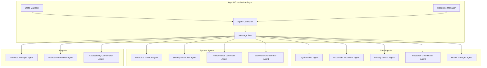
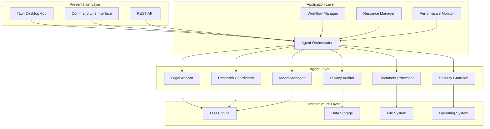
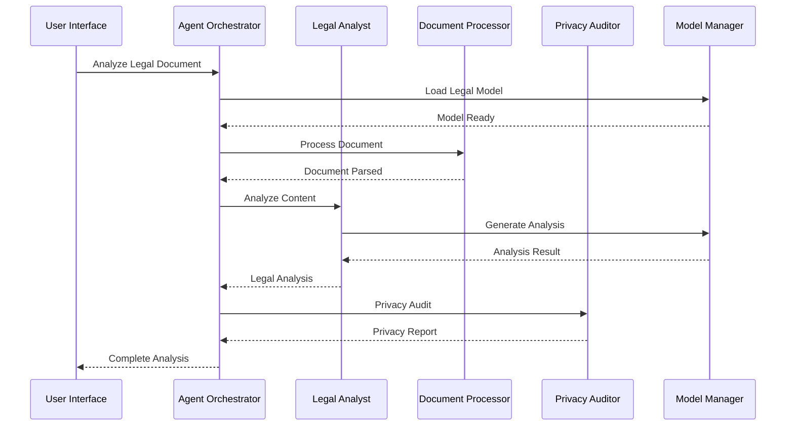

# Enhanced BEAR AI Architecture v2.0

## Executive Summary

This document outlines the enhanced architecture for BEAR AI incorporating insights from jan-dev and modern development patterns. The new architecture transforms BEAR AI from a monolithic Python application into a modern, multi-agent, cross-platform system using Vite + TypeScript + Tauri, with advanced agent orchestration capabilities.

## 1. System Architecture Overview

### 1.1 Current State Analysis

**BEAR AI v1.x (Current)**:
- Monolithic Python application
- React-based GUI (separate)
- Direct LLM integration
- Limited scalability
- Manual coordination

**jan-dev Insights Applied**:
- Modular extension system
- Tauri desktop integration
- Modern build tooling
- Cross-platform compatibility
- Plugin architecture

### 1.2 Enhanced Architecture Vision

**BEAR AI v2.0 (Target)**:
- Multi-agent system with autonomous coordination
- Offline-first architecture with no external dependencies
- Cross-platform desktop application with LanceDB storage
- Plugin/extension ecosystem for local functionality
- Advanced performance monitoring with privacy protection

## 2. Multi-Agent System Architecture

### 2.1 Agent Taxonomy

```typescript
interface AgentType {
  // Core Development Agents
  'legal-analyst': LegalAnalysisAgent
  'document-processor': DocumentProcessingAgent
  'privacy-auditor': PrivacyAuditAgent
  'research-coordinator': ResearchAgent
  'model-manager': ModelManagementAgent
  
  // System Agents
  'resource-monitor': ResourceMonitorAgent
  'security-guardian': SecurityAgent
  'performance-optimizer': PerformanceAgent
  'workflow-orchestrator': WorkflowAgent
  
  // UI/UX Agents
  'interface-manager': UIAgent
  'notification-handler': NotificationAgent
  'accessibility-coordinator': AccessibilityAgent
}
```

### 2.2 Agent Communication Architecture



### 2.3 Component Separation and Boundaries

```typescript
// Core Architecture Structure
interface CoreArchitecture {
  // Domain Layer
  domain: {
    legal: LegalDomain
    privacy: PrivacyDomain
    research: ResearchDomain
    models: ModelDomain
  }
  
  // Application Layer
  application: {
    services: ApplicationServices
    handlers: CommandHandlers
    queries: QueryHandlers
    workflows: WorkflowOrchestration
  }
  
  // Infrastructure Layer
  infrastructure: {
    persistence: DataPersistence
    external: ExternalIntegrations
    messaging: MessageBroker
    monitoring: SystemMonitoring
  }
  
  // Presentation Layer
  presentation: {
    desktop: TauriApplication
    web: WebInterface
    cli: CommandLineInterface
    api: RESTfulAPI
  }
}
```

## 3. Technology Stack Integration

### 3.1 Modern Build System (Vite + TypeScript)

**Benefits from jan-dev adoption**:
- Hot module replacement (HMR)
- Fast development builds
- Tree-shaking optimization
- Modern ES modules support
- TypeScript integration

```javascript
// vite.config.ts - Enhanced BEAR AI Configuration
export default defineConfig({
  plugins: [
    react(),
    tailwindcss(),
    // BEAR AI specific plugins
    bearAIExtensions(),
    agentOrchestrator(),
    privacyGuard(),
  ],
  define: {
    // Platform detection
    IS_TAURI: JSON.stringify(process.env.IS_TAURI),
    IS_DESKTOP: JSON.stringify(true),
    IS_PRIVACY_MODE: JSON.stringify(true),
    
    // BEAR AI specific flags
    LEGAL_COMPLIANCE_MODE: JSON.stringify(env.LEGAL_COMPLIANCE_MODE),
    OFFLINE_ONLY: JSON.stringify(true),
    AUDIT_LOGGING: JSON.stringify(env.AUDIT_LOGGING ?? true),
    VECTOR_STORE: JSON.stringify('lancedb'),
  },
  build: {
    target: 'esnext',
    rollupOptions: {
      external: ['python-shell', 'node-llama-cpp']
    }
  }
})
```

### 3.2 Tauri Desktop Integration

**Enhanced desktop capabilities**:
- Native OS integration
- File system access with permissions
- System tray functionality
- Native notifications
- Hardware acceleration

```rust
// src-tauri/tauri.conf.json - BEAR AI Configuration
{
  "productName": "BEAR AI",
  "version": "2.0.0",
  "identifier": "ai.bear.app",
  "build": {
    "frontendDist": "../dist",
    "beforeDevCommand": "npm run dev",
    "beforeBuildCommand": "npm run build"
  },
  "app": {
    "security": {
      "csp": {
        "default-src": "'self' file:",
        "connect-src": "'self' http://localhost:* ws://localhost:*",
        "script-src": "'self' 'unsafe-inline'",
        "style-src": "'self' 'unsafe-inline'"
      }
    },
    "windows": [{
      "title": "BEAR AI - Legal Assistant",
      "width": 1200,
      "height": 800,
      "minWidth": 800,
      "minHeight": 600,
      "center": true,
      "resizable": true,
      "decorations": true,
      "transparent": false
    }]
  },
  "plugins": {
    "os": {},
    "fs": {
      "all": false,
      "readFile": true,
      "writeFile": true,
      "readDir": true,
      "scope": ["$APPDATA/bear-ai", "$DOCUMENT"]
    },
    "shell": {
      "all": false,
      "execute": true,
      "scope": ["python", "llamacpp"]
    }
  }
}
```

### 3.3 Local LLM Integration Architecture

```typescript
interface LLMIntegrationLayer {
  // Model Management
  modelManager: {
    discovery: ModelDiscoveryService
    download: ModelDownloadService
    validation: ModelValidationService
    optimization: ModelOptimizationService
  }
  
  // Inference Engine
  inferenceEngine: {
    llamacpp: LlamaCppProvider
    python: PythonProvider
    onnx: ONNXProvider
    custom: CustomProviderInterface
  }
  
  // Resource Management
  resourceManager: {
    memory: MemoryManager
    gpu: GPUManager
    cpu: CPUManager
    storage: StorageManager
  }
  
  // Privacy & Security
  privacyLayer: {
    dataEncryption: EncryptionService
    auditLogging: AuditService
    accessControl: AccessControlService
    compliance: ComplianceService
  }
}
```

## 4. Agent Spawning and Lifecycle Management

### 4.1 Agent Lifecycle States

```typescript
enum AgentState {
  INITIALIZED = 'initialized',
  STARTING = 'starting',
  ACTIVE = 'active',
  IDLE = 'idle',
  BUSY = 'busy',
  PAUSED = 'paused',
  STOPPING = 'stopping',
  STOPPED = 'stopped',
  ERROR = 'error'
}

interface AgentLifecycle {
  id: string
  type: AgentType
  state: AgentState
  capabilities: string[]
  resources: ResourceAllocation
  performance: PerformanceMetrics
  
  // Lifecycle methods
  initialize(): Promise<void>
  start(): Promise<void>
  pause(): Promise<void>
  resume(): Promise<void>
  stop(): Promise<void>
  handleError(error: Error): Promise<void>
}
```

### 4.2 Dynamic Agent Spawning

```typescript
class AgentOrchestrator {
  private agents: Map<string, Agent> = new Map()
  private resourceManager: ResourceManager
  private performanceMonitor: PerformanceMonitor
  
  async spawnAgent(config: AgentSpawnConfig): Promise<Agent> {
    // Resource validation
    const resourceCheck = await this.resourceManager.validateResources(config.requirements)
    if (!resourceCheck.sufficient) {
      throw new InsufficientResourcesError(resourceCheck.missing)
    }
    
    // Agent creation
    const agent = await this.createAgent(config)
    
    // Registration and monitoring
    this.agents.set(agent.id, agent)
    await this.performanceMonitor.registerAgent(agent)
    
    // Start lifecycle
    await agent.initialize()
    await agent.start()
    
    return agent
  }
  
  async coordinateAgents(task: Task): Promise<TaskResult> {
    const requiredAgents = this.selectOptimalAgents(task)
    const coordination = new AgentCoordination(requiredAgents)
    
    return await coordination.execute(task)
  }
}
```

## 5. Scalability Design and Resource Management

### 5.1 Resource Allocation Strategy

```typescript
interface ResourceAllocationStrategy {
  // Memory Management
  memory: {
    maxHeapSize: number
    gcStrategy: 'aggressive' | 'balanced' | 'minimal'
    memoryPools: MemoryPoolConfig[]
  }
  
  // CPU Management
  cpu: {
    maxThreads: number
    threadPriority: ThreadPriority
    affinityMask: number
    schedulingPolicy: 'fifo' | 'round_robin' | 'priority'
  }
  
  // GPU Management (if available)
  gpu: {
    maxVRAM: number
    computeUnits: number
    memoryBandwidth: number
    priority: GPUPriority
  }
  
  // Storage Management
  storage: {
    tempDirectory: string
    maxCacheSize: number
    compressionLevel: number
    retentionPolicy: RetentionPolicy
  }
}
```

### 5.2 Load Balancing and Auto-scaling

```typescript
class AutoScaler {
  private readonly thresholds = {
    cpuHigh: 80,
    cpuLow: 30,
    memoryHigh: 85,
    memoryLow: 40,
    responseTimeHigh: 5000, // ms
    queueSizeHigh: 100
  }
  
  async monitorAndScale(): Promise<void> {
    const metrics = await this.performanceMonitor.getCurrentMetrics()
    
    // Scale up conditions
    if (metrics.cpu > this.thresholds.cpuHigh || 
        metrics.memory > this.thresholds.memoryHigh ||
        metrics.responseTime > this.thresholds.responseTimeHigh) {
      await this.scaleUp()
    }
    
    // Scale down conditions
    if (metrics.cpu < this.thresholds.cpuLow && 
        metrics.memory < this.thresholds.memoryLow &&
        metrics.queueSize === 0) {
      await this.scaleDown()
    }
  }
  
  private async scaleUp(): Promise<void> {
    const availableResources = await this.resourceManager.getAvailableResources()
    if (availableResources.sufficient) {
      await this.spawnAdditionalAgents()
    } else {
      await this.optimizeExistingAgents()
    }
  }
}
```

## 6. Performance Monitoring and Optimization

### 6.1 Real-time Metrics Collection

```typescript
interface PerformanceMetrics {
  // System Metrics
  system: {
    cpuUsage: number
    memoryUsage: number
    diskIO: number
    networkIO: number
    gpuUsage?: number
  }
  
  // Agent Metrics
  agents: {
    [agentId: string]: {
      tasksCompleted: number
      averageResponseTime: number
      errorRate: number
      resourceUtilization: number
    }
  }
  
  // Application Metrics
  application: {
    totalRequests: number
    requestsPerSecond: number
    averageLatency: number
    errorCount: number
    activeConnections: number
  }
  
  // LLM Metrics
  llm: {
    tokenThroughput: number
    inferenceTime: number
    modelLoadTime: number
    contextWindowUsage: number
  }
}
```

### 6.2 Intelligent Optimization Engine

```typescript
class OptimizationEngine {
  private readonly optimizers = [
    new MemoryOptimizer(),
    new CPUOptimizer(),
    new ModelOptimizer(),
    new NetworkOptimizer(),
    new CacheOptimizer()
  ]
  
  async optimizeSystem(): Promise<OptimizationResult> {
    const currentMetrics = await this.metricsCollector.getMetrics()
    const optimizations: OptimizationAction[] = []
    
    for (const optimizer of this.optimizers) {
      const actions = await optimizer.analyze(currentMetrics)
      optimizations.push(...actions)
    }
    
    // Prioritize optimizations
    const prioritized = this.prioritizeOptimizations(optimizations)
    
    // Execute optimizations
    const results = await this.executeOptimizations(prioritized)
    
    return {
      actionsExecuted: results.length,
      performanceImprovement: await this.measureImprovement(),
      recommendations: this.generateRecommendations()
    }
  }
}
```

## 7. Implementation Roadmap

### 7.1 Phase 1: Foundation (Months 1-2)
- Set up Vite + TypeScript + Tauri build system
- Create core agent architecture
- Implement basic resource management
- Migrate essential Python modules

### 7.2 Phase 2: Core Agents (Months 3-4)
- Develop legal analysis agent
- Implement document processing agent
- Create privacy audit agent
- Build model management system

### 7.3 Phase 3: Advanced Features (Months 5-6)
- Performance monitoring system
- Auto-scaling capabilities
- Advanced optimization engine
- Extension/plugin system

### 7.4 Phase 4: Integration & Testing (Months 7-8)
- Comprehensive testing framework
- Performance benchmarking
- Security auditing
- User acceptance testing

## 8. Migration Strategy

### 8.1 Gradual Migration Approach

```typescript
interface MigrationPhase {
  phase: number
  description: string
  components: string[]
  dependencies: number[]
  timeline: string
  riskLevel: 'low' | 'medium' | 'high'
}

const migrationPlan: MigrationPhase[] = [
  {
    phase: 1,
    description: "Infrastructure Setup",
    components: ["build-system", "tauri-app", "basic-ui"],
    dependencies: [],
    timeline: "4 weeks",
    riskLevel: "low"
  },
  {
    phase: 2,
    description: "Core Module Migration",
    components: ["inference-engine", "model-manager", "basic-chat"],
    dependencies: [1],
    timeline: "6 weeks",
    riskLevel: "medium"
  },
  {
    phase: 3,
    description: "Agent System Implementation",
    components: ["agent-orchestrator", "resource-manager", "performance-monitor"],
    dependencies: [2],
    timeline: "8 weeks",
    riskLevel: "high"
  }
]
```

### 8.2 Data Migration Strategy

```typescript
class DataMigrator {
  async migrateUserData(source: string, target: string): Promise<void> {
    // Backup existing data
    await this.createBackup(source)
    
    // Transform data structures
    const transformedData = await this.transformData(source, target)
    
    // Validate integrity
    await this.validateDataIntegrity(transformedData)
    
    // Import to new system
    await this.importData(transformedData, target)
    
    // Verify migration
    await this.verifyMigration(source, target)
  }
}
```

## 9. Testing and Validation Architecture

### 9.1 Multi-layered Testing Strategy

```typescript
interface TestingStrategy {
  // Unit Testing
  unit: {
    framework: 'vitest'
    coverage: 90
    agents: AgentUnitTests
    services: ServiceUnitTests
    utilities: UtilityUnitTests
  }
  
  // Integration Testing
  integration: {
    framework: 'playwright'
    agentCommunication: AgentIntegrationTests
    systemIntegration: SystemIntegrationTests
    apiIntegration: APIIntegrationTests
  }
  
  // End-to-End Testing
  e2e: {
    framework: 'playwright'
    userWorkflows: E2EWorkflowTests
    performanceTests: E2EPerformanceTests
    securityTests: E2ESecurityTests
  }
  
  // Load Testing
  load: {
    framework: 'k6'
    concurrentUsers: number
    throughputTargets: ThroughputTargets
    resourceLimits: ResourceLimits
  }
}
```

### 9.2 Automated Quality Assurance

```typescript
class QualityAssuranceSystem {
  async runComprehensiveTests(): Promise<QAReport> {
    const results = await Promise.all([
      this.runUnitTests(),
      this.runIntegrationTests(),
      this.runE2ETests(),
      this.runPerformanceTests(),
      this.runSecurityTests(),
      this.runComplianceTests()
    ])
    
    return this.generateQAReport(results)
  }
  
  async validateAgentBehavior(agent: Agent): Promise<ValidationResult> {
    return {
      functionalCorrectness: await this.testFunctionality(agent),
      performanceMetrics: await this.benchmarkPerformance(agent),
      resourceUsage: await this.analyzeResourceUsage(agent),
      securityCompliance: await this.auditSecurity(agent),
      privacyCompliance: await this.auditPrivacy(agent)
    }
  }
}
```

## 10. Architecture Decision Records (ADRs)

### ADR-001: Technology Stack Selection
**Decision**: Adopt Vite + TypeScript + Tauri stack
**Rationale**: 
- Modern development experience
- Cross-platform compatibility
- Performance optimization
- Strong typing support
- Active ecosystem

### ADR-002: Multi-Agent Architecture
**Decision**: Implement autonomous multi-agent system
**Rationale**:
- Scalability requirements
- Modularity and maintainability
- Parallel processing capabilities
- Fault tolerance
- Future extensibility

### ADR-003: Local-First Privacy Model
**Decision**: Maintain strict local-only operation
**Rationale**:
- Privacy compliance requirements
- Legal profession security standards
- User trust and adoption
- Regulatory compliance
- Data sovereignty

## 11. System Diagrams and Component Interactions

### 11.1 High-Level System Architecture



### 11.2 Agent Communication Flow



## 12. Conclusion

The enhanced BEAR AI architecture represents a significant evolution from the current monolithic system to a modern, multi-agent, cross-platform application. By incorporating insights from jan-dev and leveraging modern development practices, this architecture provides:

1. **Scalability**: Multi-agent system with dynamic resource allocation
2. **Performance**: Optimized build system and intelligent resource management
3. **Maintainability**: Modular design with clear separation of concerns
4. **Extensibility**: Plugin architecture for future enhancements
5. **Privacy**: Maintained local-first approach with enhanced security
6. **User Experience**: Modern desktop application with native OS integration

The implementation roadmap provides a structured approach to migration, ensuring minimal disruption to existing users while delivering significant improvements in functionality and performance.

This architecture positions BEAR AI as a leading privacy-first legal AI assistant, capable of meeting the evolving needs of legal professionals while maintaining the highest standards of security and compliance.