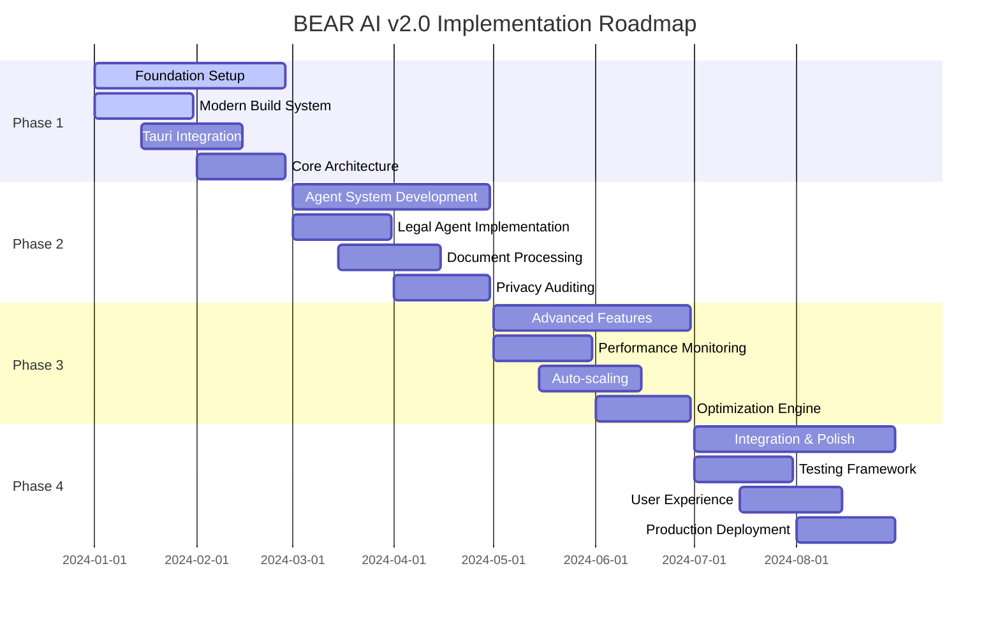

# Implementation Roadmap - BEAR AI v2.0

## Executive Summary

This roadmap outlines the systematic migration of BEAR AI from its current Python-based monolithic architecture to a modern, multi-agent system built on Vite + TypeScript + Tauri. The implementation is structured in four major phases over 8 months, with parallel development streams and continuous integration.

## 1. Roadmap Overview

### 1.1 High-Level Timeline



### 1.2 Development Streams

```typescript
interface DevelopmentStream {
  name: string
  owner: string
  dependencies: string[]
  deliverables: string[]
  timeline: DateRange
  riskLevel: 'low' | 'medium' | 'high'
}

const DEVELOPMENT_STREAMS: DevelopmentStream[] = [
  {
    name: 'Infrastructure & Build System',
    owner: 'Platform Team',
    dependencies: [],
    deliverables: [
      'Vite + TypeScript configuration',
      'Tauri desktop application setup',
      'CI/CD pipeline',
      'Development environment'
    ],
    timeline: { start: '2024-01-01', end: '2024-02-28' },
    riskLevel: 'low'
  },
  {
    name: 'Core Agent Architecture',
    owner: 'Architecture Team',
    dependencies: ['Infrastructure & Build System'],
    deliverables: [
      'Agent lifecycle management',
      'Communication system',
      'Resource management',
      'Coordination patterns'
    ],
    timeline: { start: '2024-02-01', end: '2024-04-30' },
    riskLevel: 'high'
  },
  {
    name: 'Legal AI Agents',
    owner: 'Legal AI Team',
    dependencies: ['Core Agent Architecture'],
    deliverables: [
      'Legal analyst agent',
      'Document processor agent',
      'Privacy auditor agent',
      'Research coordinator agent'
    ],
    timeline: { start: '2024-03-01', end: '2024-06-30' },
    riskLevel: 'medium'
  },
  {
    name: 'Performance & Optimization',
    owner: 'Performance Team',
    dependencies: ['Core Agent Architecture'],
    deliverables: [
      'Monitoring system',
      'Optimization engine',
      'Predictive analytics',
      'Auto-scaling'
    ],
    timeline: { start: '2024-05-01', end: '2024-07-31' },
    riskLevel: 'medium'
  },
  {
    name: 'User Interface & Experience',
    owner: 'Frontend Team',
    dependencies: ['Infrastructure & Build System'],
    deliverables: [
      'Modern React UI',
      'Performance dashboard',
      'Agent management interface',
      'Legal workflow UI'
    ],
    timeline: { start: '2024-02-15', end: '2024-08-15' },
    riskLevel: 'low'
  }
]
```

## 2. Phase 1: Foundation Setup (Months 1-2)

### 2.1 Sprint Breakdown

#### Sprint 1.1: Modern Build System (Weeks 1-2)
**Goal**: Establish modern development environment with Vite + TypeScript

**Key Deliverables**:
- [ ] Vite configuration with TypeScript support
- [ ] ESLint + Prettier setup
- [ ] Path aliases and module resolution
- [ ] Hot module replacement (HMR) configuration
- [ ] Environment variable management
- [ ] Build optimization settings

**Technical Tasks**:
```typescript
// Week 1: Basic Setup
const sprint1_1_tasks = [
  'Initialize Vite project with TypeScript template',
  'Configure path aliases (@components, @services, @types)',
  'Set up ESLint with TypeScript rules',
  'Configure Prettier for code formatting',
  'Create development and production build configs',
  'Set up environment variable handling'
]

// Week 2: Advanced Configuration  
const sprint1_1_advanced = [
  'Configure Rollup bundle optimization',
  'Set up code splitting and lazy loading',
  'Implement source map generation',
  'Configure asset optimization',
  'Set up development server with proxy',
  'Create build validation scripts'
]
```

**Success Criteria**:
- Development server starts in <3 seconds
- TypeScript compilation without errors
- HMR updates in <200ms
- Production build size <2MB
- All linting rules pass

#### Sprint 1.2: Tauri Desktop Integration (Weeks 3-4)
**Goal**: Create cross-platform desktop application foundation

**Key Deliverables**:
- [ ] Tauri project initialization
- [ ] Rust backend structure
- [ ] Frontend-backend communication
- [ ] Native OS integration setup
- [ ] Security configuration
- [ ] Icon and branding assets

**Technical Implementation**:
```rust
// src-tauri/src/main.rs - Basic setup
#[cfg_attr(not(debug_assertions), windows_subsystem = "windows")]

use tauri::{Builder, generate_handler};
use std::collections::HashMap;

mod commands;
mod state;
mod utils;

fn main() {
    Builder::default()
        .setup(|app| {
            // Initialize application state
            let initial_state = state::AppState::new();
            app.manage(initial_state);
            Ok(())
        })
        .invoke_handler(generate_handler![
            commands::get_system_info,
            commands::initialize_agents,
            commands::load_model,
        ])
        .run(tauri::generate_context!())
        .expect("error while running tauri application");
}
```

**Success Criteria**:
- Desktop application launches successfully
- Frontend-backend commands work
- File system access with proper permissions
- Native notifications functional
- Security policies properly configured

#### Sprint 1.3: Core Architecture Foundation (Weeks 5-6)
**Goal**: Implement basic agent architecture and communication

**Key Deliverables**:
- [ ] Agent interface definitions
- [ ] Message bus implementation
- [ ] Resource manager skeleton
- [ ] State management system
- [ ] Error handling framework
- [ ] Logging and telemetry setup

#### Sprint 1.4: Python Bridge Implementation (Weeks 7-8)
**Goal**: Create seamless integration with existing Python codebase

**Key Deliverables**:
- [ ] Python-Rust communication bridge
- [ ] Existing model integration
- [ ] Data format converters
- [ ] Error propagation system
- [ ] Performance benchmarking tools

### 2.2 Risk Mitigation Strategies

```typescript
interface RiskMitigationPlan {
  risk: string
  impact: 'low' | 'medium' | 'high'
  probability: 'low' | 'medium' | 'high'
  mitigation: string[]
  contingency: string
}

const PHASE_1_RISKS: RiskMitigationPlan[] = [
  {
    risk: 'Tauri compatibility issues with existing Python code',
    impact: 'high',
    probability: 'medium',
    mitigation: [
      'Create comprehensive compatibility test suite',
      'Develop Python subprocess communication layer',
      'Implement fallback to HTTP API communication',
      'Regular integration testing with Python components'
    ],
    contingency: 'Maintain hybrid architecture with web-based fallback'
  },
  {
    risk: 'Performance degradation during migration',
    impact: 'medium',
    probability: 'high',
    mitigation: [
      'Implement performance monitoring from day one',
      'Create benchmarking suite for critical operations',
      'Profile memory usage continuously',
      'Optimize critical paths early'
    ],
    contingency: 'Implement performance regression rollback mechanism'
  }
]
```

## 3. Phase 2: Core Agent Implementation (Months 3-4)

### 3.1 Agent Development Priorities

#### Sprint 2.1: Legal Analyst Agent (Weeks 9-10)
**Goal**: Implement core legal document analysis capabilities

**Key Features**:
- [ ] Contract analysis and risk assessment
- [ ] Legal precedent research
- [ ] Compliance checking
- [ ] Citation validation
- [ ] Risk scoring algorithms

**Technical Implementation**:
```typescript
class LegalAnalystAgent extends BaseAgent {
  private modelManager: ModelManager
  private knowledgeBase: LegalKnowledgeBase
  private riskAssessor: RiskAssessment
  
  async analyzeContract(document: LegalDocument): Promise<ContractAnalysis> {
    // Multi-stage analysis pipeline
    const stages: AnalysisStage[] = [
      new DocumentPreprocessor(),
      new ClauseExtractor(),
      new RiskAnalyzer(), 
      new ComplianceChecker(),
      new RecommendationEngine()
    ]
    
    let analysis: Partial<ContractAnalysis> = { document }
    
    for (const stage of stages) {
      analysis = await stage.process(analysis)
      
      // Emit progress updates
      this.emit('analysis-progress', {
        stage: stage.name,
        progress: (stages.indexOf(stage) + 1) / stages.length,
        intermediate: analysis
      })
    }
    
    return analysis as ContractAnalysis
  }
  
  async researchPrecedents(query: LegalQuery): Promise<PrecedentResult[]> {
    const searchStrategy = this.selectSearchStrategy(query)
    const results = await this.knowledgeBase.search(query, searchStrategy)
    
    return results.map(result => ({
      case: result.case,
      relevance: this.calculateRelevanceScore(query, result),
      citation: result.citation,
      summary: result.summary,
      keyPoints: this.extractKeyPoints(result)
    }))
  }
}
```

#### Sprint 2.2: Document Processor Agent (Weeks 11-12)
**Goal**: Handle multi-format document processing and extraction

**Key Features**:
- [ ] PDF text extraction with layout preservation
- [ ] OCR for scanned documents
- [ ] Document classification and metadata extraction
- [ ] Multi-language support
- [ ] Batch processing capabilities

#### Sprint 2.3: Privacy Auditor Agent (Weeks 13-14)
**Goal**: Implement comprehensive privacy compliance checking

**Key Features**:
- [ ] PII detection and classification
- [ ] GDPR compliance assessment
- [ ] Data flow analysis
- [ ] Privacy risk scoring
- [ ] Remediation recommendations

#### Sprint 2.4: Research Coordinator Agent (Weeks 15-16)
**Goal**: Orchestrate complex research workflows

**Key Features**:
- [ ] Multi-source information gathering
- [ ] Research task decomposition
- [ ] Source credibility assessment
- [ ] Information synthesis
- [ ] Report generation

### 3.2 Integration Testing Framework

```typescript
class AgentIntegrationTester {
  private testSuites: Map<string, TestSuite> = new Map()
  private mockFramework: AgentMockFramework
  
  async runIntegrationTests(
    agentType: AgentType,
    testScenarios: TestScenario[]
  ): Promise<IntegrationTestResult> {
    const results: TestResult[] = []
    
    for (const scenario of testScenarios) {
      const testResult = await this.executeTestScenario(
        agentType,
        scenario
      )
      results.push(testResult)
      
      // Fail fast on critical failures
      if (testResult.critical && !testResult.passed) {
        throw new CriticalTestFailureError(scenario.name, testResult.error)
      }
    }
    
    return {
      agentType,
      totalTests: testScenarios.length,
      passed: results.filter(r => r.passed).length,
      failed: results.filter(r => !r.passed).length,
      coverage: this.calculateTestCoverage(results),
      performance: this.analyzePerformanceMetrics(results),
      results
    }
  }
  
  private async executeTestScenario(
    agentType: AgentType,
    scenario: TestScenario
  ): Promise<TestResult> {
    const startTime = Date.now()
    
    try {
      // Set up test environment
      await this.setupTestEnvironment(scenario)
      
      // Create agent instance
      const agent = await this.createTestAgent(agentType, scenario.config)
      
      // Execute test steps
      const stepResults = []
      for (const step of scenario.steps) {
        const stepResult = await this.executeTestStep(agent, step)
        stepResults.push(stepResult)
        
        if (!stepResult.passed && step.critical) {
          break
        }
      }
      
      // Validate final state
      const validation = await this.validateFinalState(
        agent,
        scenario.expectedOutcome
      )
      
      return {
        scenario: scenario.name,
        passed: stepResults.every(r => r.passed) && validation.valid,
        duration: Date.now() - startTime,
        stepResults,
        validation,
        metrics: await this.collectTestMetrics(agent)
      }
      
    } catch (error) {
      return {
        scenario: scenario.name,
        passed: false,
        duration: Date.now() - startTime,
        error: error.message,
        critical: scenario.critical
      }
    } finally {
      await this.cleanupTestEnvironment(scenario)
    }
  }
}
```

## 4. Phase 3: Advanced Features (Months 5-6)

### 4.1 Performance Monitoring Implementation

#### Sprint 3.1: Telemetry Infrastructure (Weeks 17-18)
**Goal**: Build comprehensive performance monitoring system

**Key Components**:
- [ ] Real-time metrics collection
- [ ] Time-series database integration
- [ ] Performance dashboard
- [ ] Alert management system
- [ ] Anomaly detection algorithms

**Implementation Strategy**:
```typescript
class PerformanceMonitoringSystem {
  private collectors: MetricCollector[]
  private storage: TimeSeriesDB
  private dashboard: PerformanceDashboard
  private alerting: AlertingSystem
  
  async initializeMonitoring(): Promise<void> {
    // Initialize metric collectors
    this.collectors = [
      new SystemMetricsCollector(),
      new AgentMetricsCollector(), 
      new ModelMetricsCollector(),
      new UserExperienceCollector()
    ]
    
    // Start collection pipelines
    await Promise.all(
      this.collectors.map(collector => collector.start())
    )
    
    // Initialize real-time dashboard
    await this.dashboard.initialize()
    
    // Set up alerting rules
    await this.setupAlertingRules()
  }
  
  private async setupAlertingRules(): Promise<void> {
    const criticalRules = [
      {
        metric: 'agent.response_time',
        condition: 'greater_than',
        threshold: 10000, // 10 seconds
        severity: 'critical',
        action: 'restart_agent'
      },
      {
        metric: 'system.memory_usage',
        condition: 'greater_than',
        threshold: 0.9, // 90%
        severity: 'warning',
        action: 'trigger_gc'
      }
    ]
    
    await this.alerting.configureRules(criticalRules)
  }
}
```

#### Sprint 3.2: Auto-scaling Engine (Weeks 19-20)
**Goal**: Implement intelligent resource scaling

#### Sprint 3.3: Optimization Algorithms (Weeks 21-22)
**Goal**: Develop multi-dimensional optimization system

#### Sprint 3.4: Predictive Analytics (Weeks 23-24)
**Goal**: Build ML-powered performance prediction

### 4.2 Extension System Development

```typescript
interface ExtensionManifest {
  name: string
  version: string
  author: string
  description: string
  
  // Capabilities and permissions
  capabilities: string[]
  permissions: Permission[]
  
  // Integration points
  agentTypes: AgentType[]
  hooks: HookDefinition[]
  apis: APIDefinition[]
  
  // Dependencies
  dependencies: ExtensionDependency[]
  minimumVersion: string
}

class ExtensionManager {
  private extensions: Map<string, Extension> = new Map()
  private registry: ExtensionRegistry
  
  async loadExtension(manifest: ExtensionManifest): Promise<void> {
    // Validate extension
    await this.validateExtension(manifest)
    
    // Check dependencies
    await this.resolveDependencies(manifest.dependencies)
    
    // Load extension code
    const extension = await this.loadExtensionCode(manifest)
    
    // Initialize extension
    await extension.initialize()
    
    // Register hooks and APIs
    await this.registerExtensionAPIs(extension)
    
    this.extensions.set(manifest.name, extension)
  }
}
```

## 5. Phase 4: Integration & Polish (Months 7-8)

### 5.1 Testing and Quality Assurance

#### Sprint 4.1: Comprehensive Test Suite (Weeks 25-26)
**Goal**: Achieve >90% test coverage across all components

**Testing Strategy**:
- Unit tests for all agent components
- Integration tests for agent communication
- End-to-end tests for user workflows
- Performance regression tests
- Security penetration testing
- Accessibility compliance testing

#### Sprint 4.2: User Experience Optimization (Weeks 27-28)
**Goal**: Polish user interface and experience

**UX Improvements**:
- [ ] Responsive design optimization
- [ ] Accessibility compliance (WCAG 2.1)
- [ ] Performance optimization (FCP < 1.5s)
- [ ] Mobile-responsive adaptation
- [ ] Dark mode support
- [ ] Internationalization support

#### Sprint 4.3: Security Hardening (Weeks 29-30)
**Goal**: Implement comprehensive security measures

#### Sprint 4.4: Production Deployment (Weeks 31-32)
**Goal**: Deploy to production with monitoring

### 5.2 Migration Strategy

```typescript
interface MigrationPlan {
  phases: MigrationPhase[]
  rollbackPlan: RollbackStrategy
  dataBackupStrategy: BackupStrategy
  validationChecks: ValidationCheck[]
}

const PRODUCTION_MIGRATION: MigrationPlan = {
  phases: [
    {
      name: 'Parallel Deployment',
      description: 'Run v1 and v2 systems simultaneously',
      duration: '2 weeks',
      rollbackTime: '< 5 minutes',
      successCriteria: [
        'v2 system handles 10% of production traffic',
        'Error rates remain < 0.1%',
        'Performance metrics within 95% of v1'
      ]
    },
    {
      name: 'Gradual Traffic Migration',
      description: 'Gradually increase v2 traffic to 100%',
      duration: '4 weeks',
      rollbackTime: '< 1 minute',
      successCriteria: [
        'All user workflows function correctly',
        'Data consistency maintained',
        'User satisfaction scores > 4.5/5'
      ]
    },
    {
      name: 'Legacy System Decommission',
      description: 'Shut down v1 system completely',
      duration: '2 weeks',
      rollbackTime: '< 30 minutes',
      successCriteria: [
        'All data successfully migrated',
        'No critical functionality lost',
        'System stability for 72 hours'
      ]
    }
  ],
  rollbackPlan: {
    triggers: ['Error rate > 1%', 'Performance degradation > 50%', 'Data corruption detected'],
    steps: [
      'Stop v2 traffic routing',
      'Activate v1 emergency mode',
      'Restore data from last backup',
      'Notify stakeholders'
    ]
  }
}
```

## 6. Success Metrics and KPIs

### 6.1 Technical Metrics

```typescript
interface SuccessMetrics {
  performance: {
    responseTime: { target: '<2s', current: '5s' }
    throughput: { target: '100 req/min', current: '30 req/min' }
    errorRate: { target: '<0.5%', current: '2%' }
    availability: { target: '99.9%', current: '95%' }
  }
  
  development: {
    codeQuality: { target: 'A rating', current: 'B rating' }
    testCoverage: { target: '>90%', current: '60%' }
    bugDensity: { target: '<0.1/KLOC', current: '0.5/KLOC' }
    deploymentTime: { target: '<10min', current: '60min' }
  }
  
  business: {
    userSatisfaction: { target: '>4.5/5', current: '3.8/5' }
    timeToValue: { target: '<5min', current: '30min' }
    featureAdoption: { target: '>80%', current: '45%' }
    supportTickets: { target: '<10/month', current: '50/month' }
  }
}
```

### 6.2 Milestone Gates

Each phase includes formal milestone gates with go/no-go decisions:

1. **Architecture Review Gate**: Validates system design and technical approach
2. **Integration Gate**: Confirms all components work together correctly
3. **Performance Gate**: Verifies performance targets are met
4. **Security Gate**: Validates security requirements and compliance
5. **User Acceptance Gate**: Confirms user experience meets requirements
6. **Production Readiness Gate**: Final validation before deployment

## 7. Resource Requirements and Team Structure

### 7.1 Team Composition

```typescript
interface TeamStructure {
  architecture: {
    lead: 'Senior System Architect',
    members: ['Software Architect', 'AI/ML Architect'],
    responsibilities: ['System design', 'Technology decisions', 'Integration patterns']
  }
  
  development: {
    frontend: {
      lead: 'Senior Frontend Developer',
      members: ['React Developer', 'UI/UX Developer'],
      responsibilities: ['React UI', 'Tauri integration', 'User experience']
    }
    
    backend: {
      lead: 'Senior Rust Developer',
      members: ['Rust Developer', 'Python Developer'],
      responsibilities: ['Agent system', 'Performance optimization', 'Python bridge']
    }
    
    ai: {
      lead: 'Senior AI Engineer',
      members: ['ML Engineer', 'Legal AI Specialist'],
      responsibilities: ['Agent intelligence', 'Model optimization', 'Legal workflows']
    }
  }
  
  quality: {
    lead: 'QA Lead',
    members: ['Test Automation Engineer', 'Performance Engineer'],
    responsibilities: ['Test strategy', 'Quality gates', 'Performance validation']
  }
  
  operations: {
    lead: 'DevOps Lead',
    members: ['CI/CD Engineer', 'Security Engineer'],
    responsibilities: ['Deployment pipeline', 'Monitoring', 'Security']
  }
}
```

### 7.2 Budget and Timeline

- **Total Duration**: 8 months
- **Team Size**: 12-15 developers
- **Estimated Effort**: 100-120 person-months
- **Key Dependencies**: 
  - Jan-dev codebase analysis completion
  - Hardware procurement for testing
  - Legal domain expert consultation
- **Critical Path**: Agent architecture → Legal agents → Performance optimization

This roadmap provides a structured, risk-managed approach to transforming BEAR AI into a modern, scalable, multi-agent legal AI system while maintaining continuity of service and user experience.