# System Diagrams and Component Interaction Blueprints

## Overview

This document provides comprehensive system diagrams and component interaction blueprints for BEAR AI v2.0, illustrating the enhanced architecture with multi-agent coordination, modern technology stack, and scalable design patterns.

## 1. High-Level Legal Architecture Overview

### 1.1 Overall Legal Architecture Overview

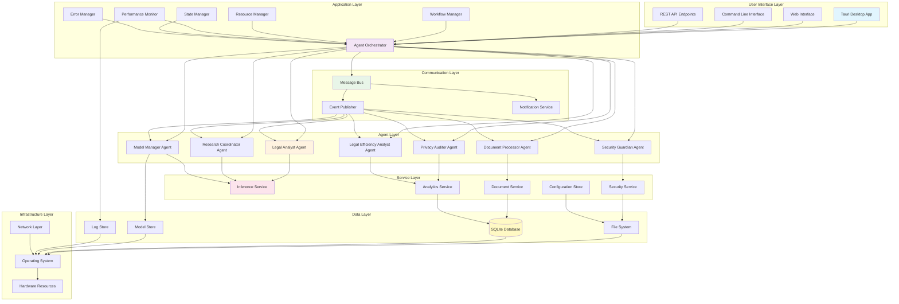

### 1.2 Technology Stack Architecture

```mermaid
graph LR
    subgraph "Frontend Stack"
        R[React 18+]
        TS[TypeScript 5+]
        TW[Tailwind CSS]
        V[Vite]
        Z[Zustand]
        RQ[React Query]
    end
    
    subgraph "Desktop Runtime"
        T[Tauri 2.x]
        WV[WebView]
        NA[Native APIs]
    end
    
    subgraph "Backend Stack"
        RS[Rust Backend]
        PB[Python Bridge]
        LC[LLaMA.cpp]
        ML[ML Models]
    end
    
    subgraph "Data & Storage"
        SQ[SQLite]
        JSON[JSON Config]
        BIN[Binary Models]
        LOG[Log Files]
    end
    
    subgraph "Development & Testing"
        VI[Vitest]
        PW[Playwright]
        ES[ESLint]
        PR[Prettier]
    end
    
    R --> TS
    TS --> V
    R --> Z
    R --> RQ
    TS --> TW
    
    V --> T
    T --> WV
    T --> NA
    T --> RS
    
    RS --> PB
    PB --> LC
    LC --> ML
    
    RS --> SQ
    TS --> JSON
    ML --> BIN
    RS --> LOG
    
    TS --> VI
    R --> PW
    TS --> ES
    TS --> PR
    
    style R fill:#61dafb
    style TS fill:#3178c6
    style T fill:#ffc131
    style RS fill:#dea584
    style SQ fill:#003b57
```

## 2. Agent Architecture Diagrams

### 2.1 Agent Ecosystem Overview

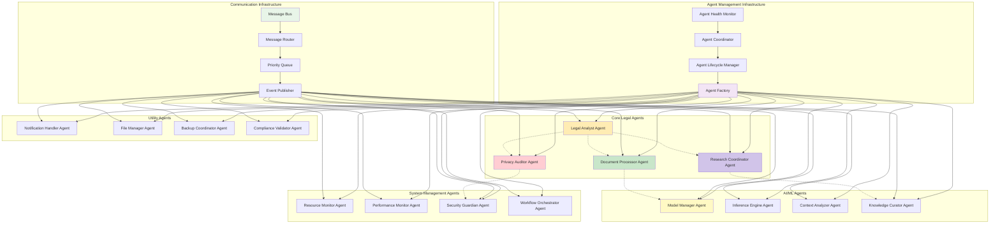

### 2.2 Agent Lifecycle State Machine

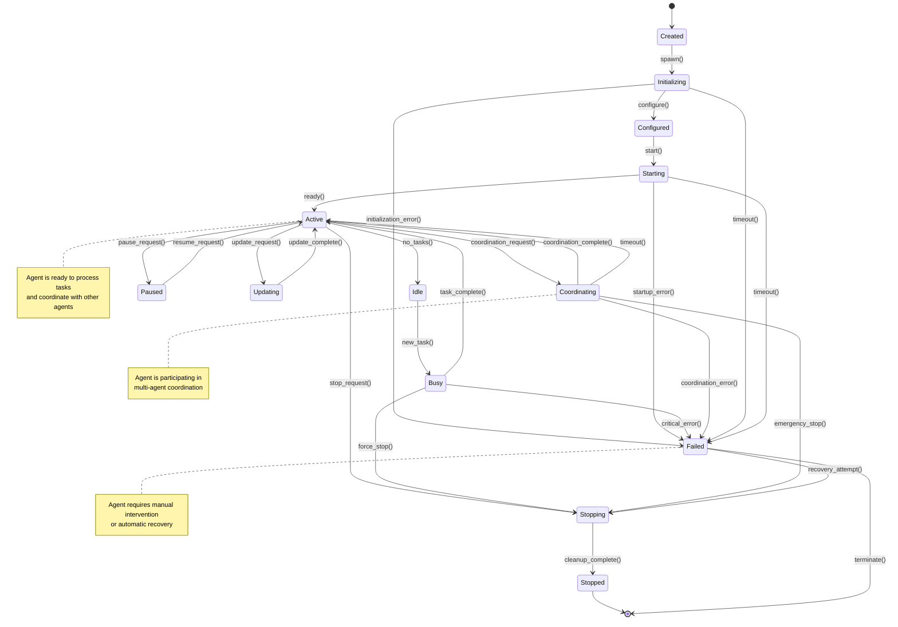

### 2.3 Agent Communication Flow

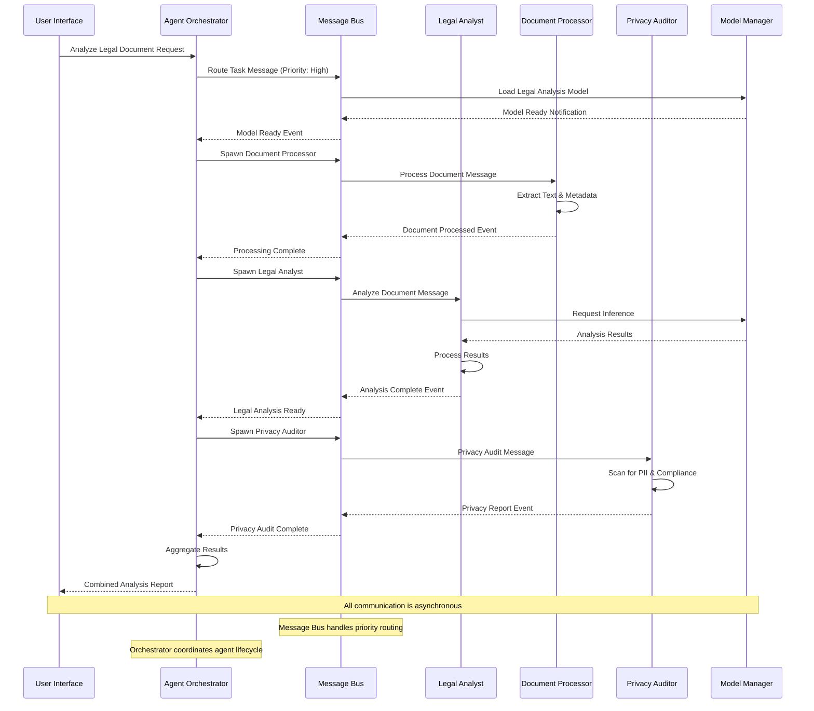

## 3. Data Flow and Component Interactions

### 3.1 Document Processing Pipeline

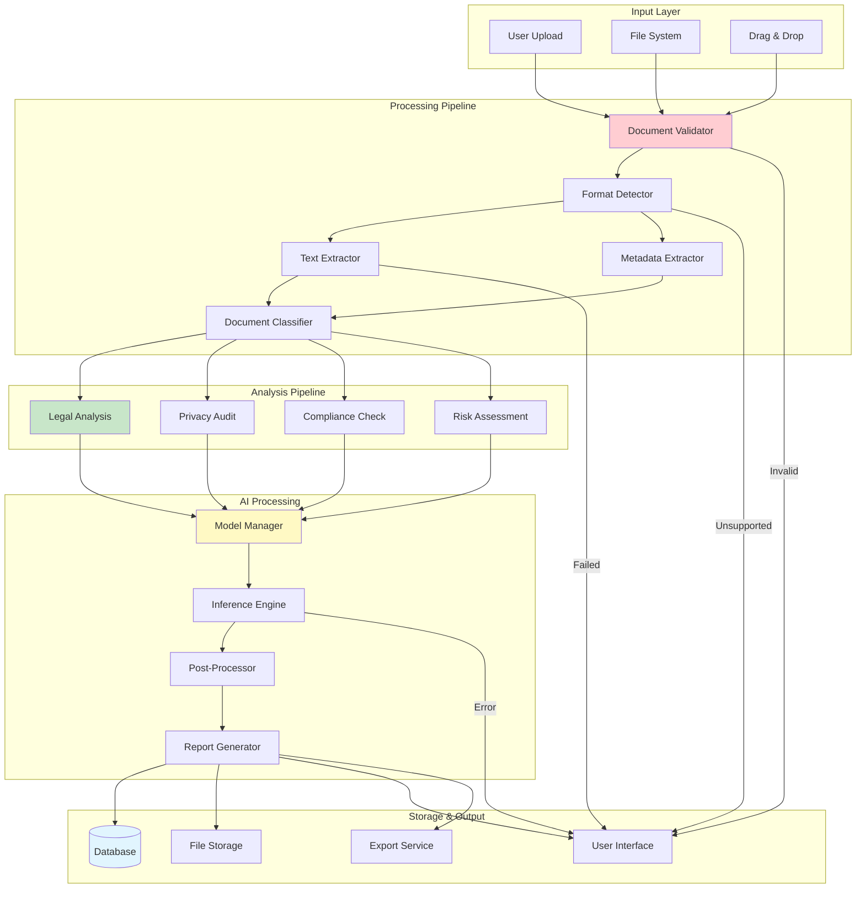

### 3.2 Model Management System

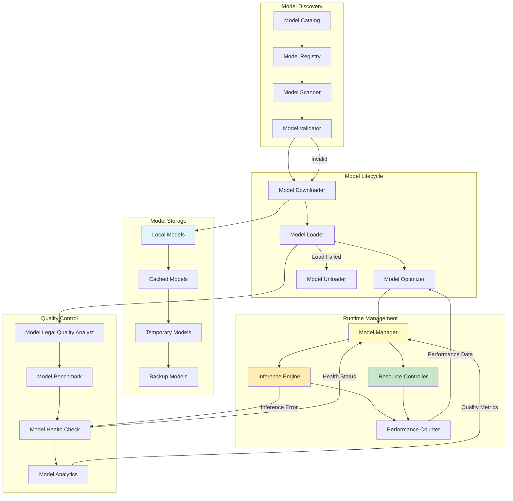

### 3.3 Performance Monitoring Architecture

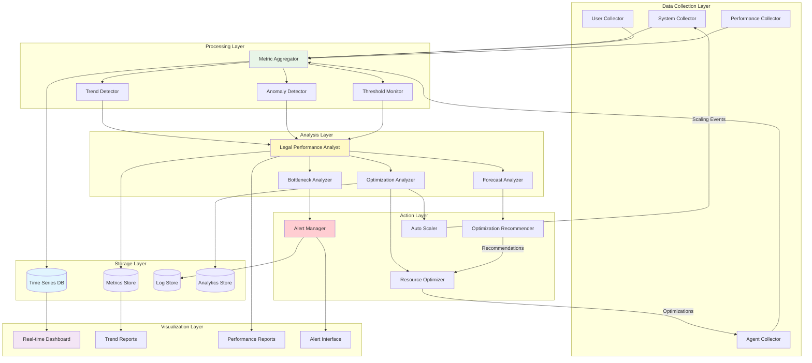

## 4. Security and Privacy Architecture

### 4.1 Security Layers and Controls

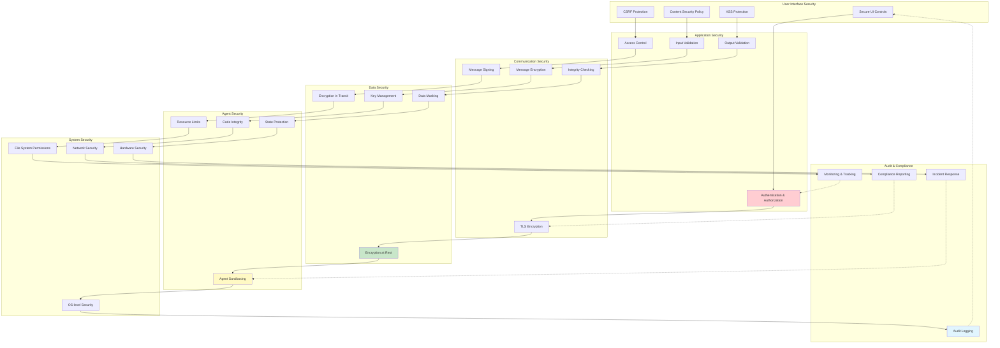

### 4.2 Privacy Protection Framework

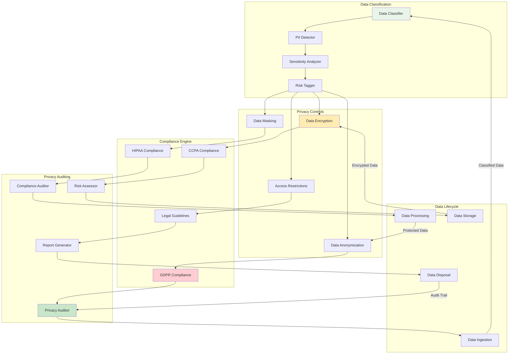

## 5. Deployment and Infrastructure

### 5.1 Build and Deployment Pipeline

```mermaid
graph LR
    subgraph "Development"
        DEV[Developer]
        GIT[Git Repository]
        PR[Pull Request]
        REV[Code Review]
    end
    
    subgraph "CI/CD Pipeline"
        CI[Continuous Integration]
        BLD[Build Process]
        TEST[Test Suite]
        PKG[Package Creation]
    end
    
    subgraph "Quality Gates"
        LINT[Code Linting]
        SEC[Security Scan]
        PERF[Performance Test]
        QA[Quality Assurance]
    end
    
    subgraph "Artifact Generation"
        BIN[Binary Creation]
        SIGN[Code Signing]
        PKG2[Package Assembly]
        DIST[Distribution Prep]
    end
    
    subgraph "Deployment Targets"
        WIN[Windows Installer]
        MAC[macOS Bundle]
        LIN[Linux Package]
        PORT[Portable Version]
    end
    
    DEV --> GIT
    GIT --> PR
    PR --> REV
    REV --> CI
    
    CI --> BLD
    BLD --> TEST
    TEST --> PKG
    
    PKG --> LINT
    LINT --> SEC
    SEC --> PERF
    PERF --> QA
    
    QA --> BIN
    BIN --> SIGN
    SIGN --> PKG2
    PKG2 --> DIST
    
    DIST --> WIN
    DIST --> MAC
    DIST --> LIN
    DIST --> PORT
    
    %% Quality feedback loops
    LINT -->|Fail| DEV
    SEC -->|Fail| DEV
    PERF -->|Fail| DEV
    QA -->|Fail| DEV
    
    style CI fill:#e8f5e8
    style TEST fill:#c8e6c9
    style SEC fill:#ffcdd2
    style BIN fill:#fff9c4
```

### 5.2 Runtime Architecture

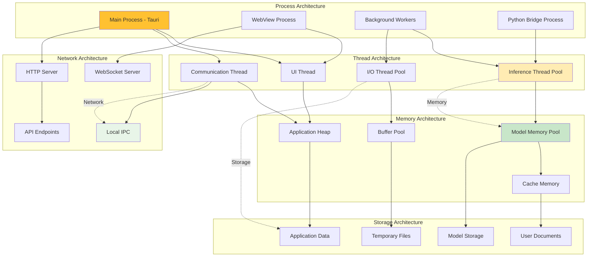

## 6. Scalability and Performance Patterns

### 6.1 Auto-scaling Architecture

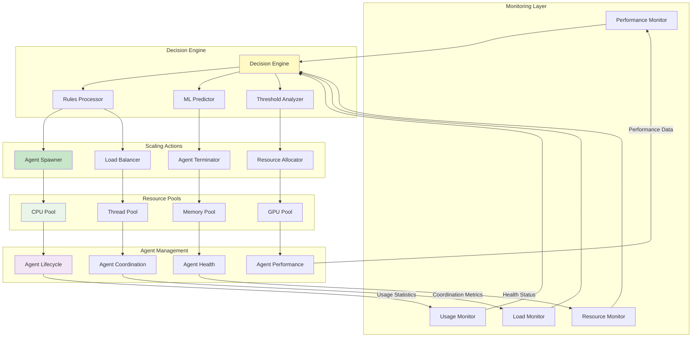

### 6.2 Caching and Optimization Strategy

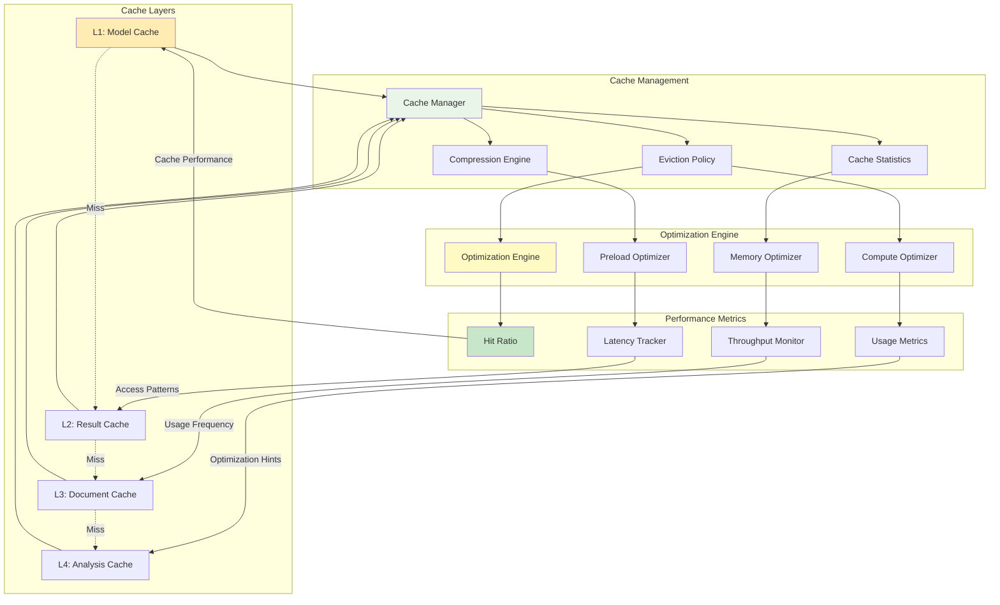

## 7. Error Handling and Resilience

### 7.1 Fault Tolerance Architecture

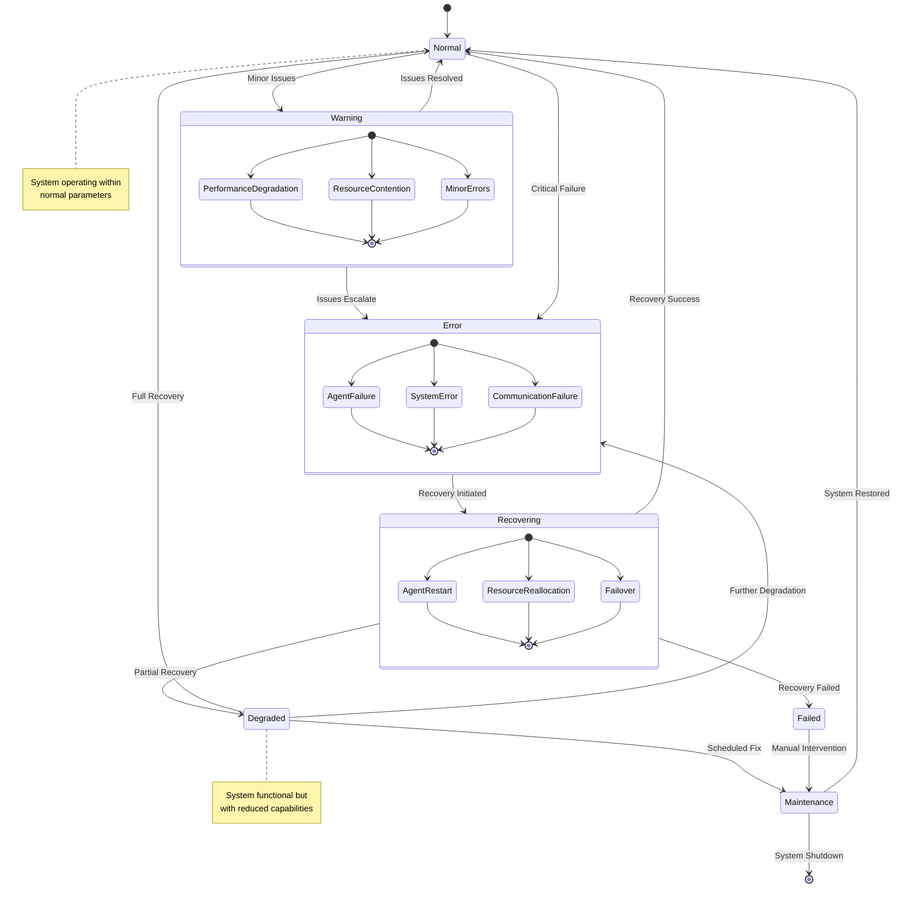

### 7.2 Circuit Breaker Pattern Implementation

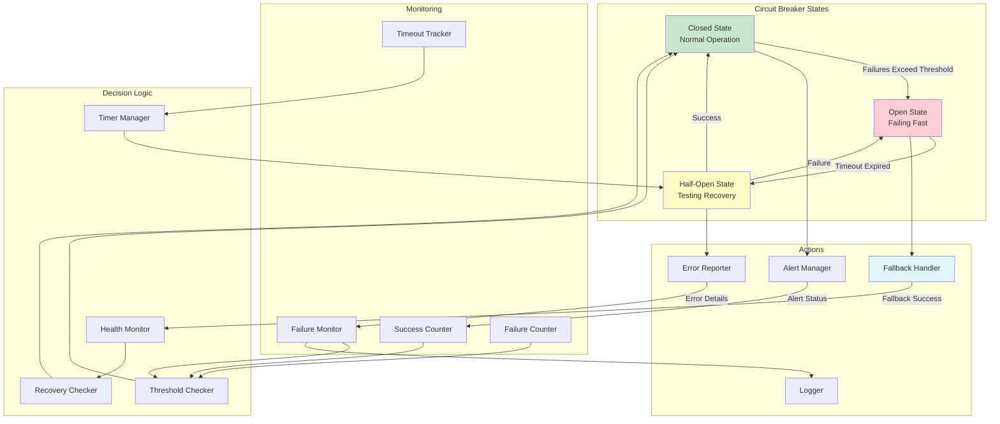

These comprehensive system diagrams and blueprints provide a complete visual guide to the enhanced BEAR AI v2.0 architecture, showing how all components interact, scale, and maintain reliability while delivering high-performance legal AI assistance.