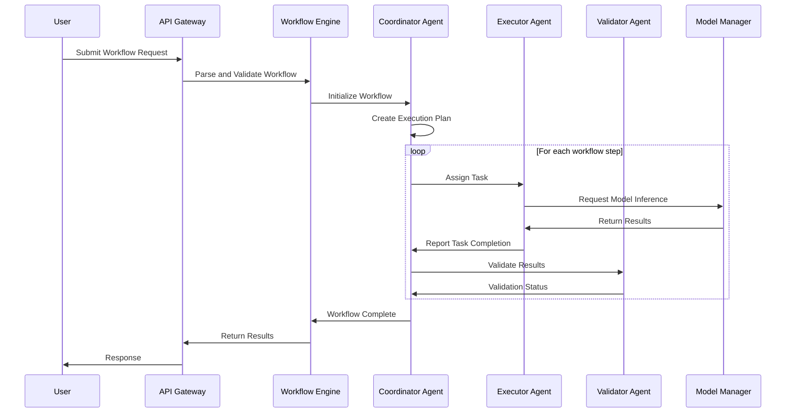
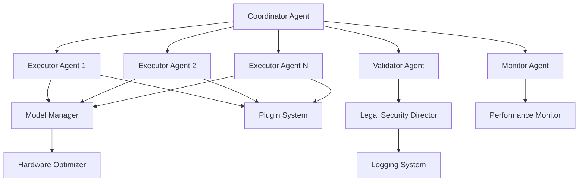

# BEAR AI Legal Architecture Overview

## Table of Contents

1. [Architecture Overview](#architecture-overview)
2. [System Components](#system-components)
3. [Component Diagrams](#component-diagrams)
4. [API Documentation](#api-documentation)
5. [Agent Interaction Patterns](#agent-interaction-patterns)
6. [Data Flow Architecture](#data-flow-architecture)
7. [Security Architecture](#security-architecture)
8. [Scalability and Performance](#scalability-and-performance)

## Architecture Overview

BEAR AI follows a modular, multi-agent architecture designed for 100% offline, privacy-first local AI processing with LanceDB vector storage. The system is built with complete network isolation, clean separation of concerns, enabling high scalability, maintainability, and extensibility.

### Architectural Principles

- **100% Offline Operation**: Complete network isolation with no external dependencies
- **Privacy First**: All processing occurs locally with LanceDB vector storage
- **Modular Design**: Loosely coupled components with well-defined interfaces
- **Multi-Agent Coordination**: Distributed task execution with intelligent coordination
- **Hardware Adaptive**: Automatic optimization based on available hardware resources
- **Plugin Extensibility**: Dynamic loading of local functionality only
- **Event-Driven Architecture**: Local asynchronous communication between components

### High-Level Architecture

```
┌─────────────────────────────────────────────────────────────────┐
│                        User Interfaces                          │
├─────────────┬─────────────┬─────────────┬─────────────────────┤
│   GUI Apps  │  CLI Tools  │  Web API    │  Desktop Apps       │
└─────────────┴─────────────┴─────────────┴─────────────────────┘
                              │
                              ▼
┌─────────────────────────────────────────────────────────────────┐
│                      API Gateway Layer                          │
├─────────────────────────────────────────────────────────────────┤
│  Authentication │ Rate Limiting │ Validation │ Request Routing  │
└─────────────────────────────────────────────────────────────────┘
                              │
                              ▼
┌─────────────────────────────────────────────────────────────────┐
│                    Workflow Orchestration                       │
├──────────────┬──────────────┬──────────────┬─────────────────────┤
│ Coordinator  │   Scheduler  │   Monitor    │   Load Balancer    │
│    Agent     │              │    Agent     │                    │
└──────────────┴──────────────┴──────────────┴─────────────────────┘
                              │
                              ▼
┌─────────────────────────────────────────────────────────────────┐
│                      Agent Ecosystem                            │
├─────────────┬─────────────┬─────────────┬─────────────────────┤
│  Executor   │  Validator  │ Specialist  │    Monitor         │
│   Agents    │   Agents    │   Agents    │    Agents          │
└─────────────┴─────────────┴─────────────┴─────────────────────┘
                              │
                              ▼
┌─────────────────────────────────────────────────────────────────┐
│                      Core Services                              │
├──────────────┬──────────────┬──────────────┬─────────────────────┤
│   Model      │     RAG      │    Plugin    │   Hardware         │
│  Management  │   Engine     │   System     │  Optimization      │
└──────────────┴──────────────┴──────────────┴─────────────────────┘
                              │
                              ▼
┌─────────────────────────────────────────────────────────────────┐
│                    Infrastructure Layer                         │
├──────────────┬──────────────┬──────────────┬─────────────────────┤
│   Storage    │   Security   │   Logging    │   Configuration    │
│   Manager    │   Manager    │   System     │     Manager        │
└──────────────┴──────────────┴──────────────┴─────────────────────┘
```

## System Components

### Core Components

#### 1. Workflow Engine (`src/bear_ai/workflows/`)

```python
class WorkflowEngine:
    """
    Central orchestration engine for multi-agent workflows
    
    Responsibilities:
    - Workflow definition and parsing
    - Agent coordination and communication
    - Task scheduling and execution
    - State management and persistence
    - Error handling and recovery
    """
```

**Key Features:**
- Asynchronous workflow execution
- Dynamic agent assignment
- Dependency resolution
- Parallel task processing
- Fault tolerance and recovery

#### 2. Agent System (`src/bear_ai/workflows/agents.py`)

```python
class WorkflowAgent(ABC):
    """
    Base class for all workflow agents
    
    Agent Types:
    - CoordinatorAgent: Orchestrates workflow execution
    - ExecutorAgent: Performs specific tasks
    - ValidatorAgent: Ensures quality and compliance
    - MonitorAgent: Tracks system performance
    - SpecialistAgent: Domain-specific expertise
    """
```

**Agent Architecture:**

```
┌─────────────────────────────────────────────────────────────┐
│                    Agent Architecture                        │
├─────────────────────────────────────────────────────────────┤
│                                                             │
│  ┌─────────────┐  ┌─────────────┐  ┌─────────────┐       │
│  │ Agent Core  │  │   Memory    │  │ Capabilities│       │
│  │             │  │   System    │  │   Manager   │       │
│  └─────────────┘  └─────────────┘  └─────────────┘       │
│         │                 │                 │             │
│         ▼                 ▼                 ▼             │
│  ┌─────────────────────────────────────────────────────┐  │
│  │             Task Execution Engine                   │  │
│  └─────────────────────────────────────────────────────┘  │
│         │                                               │
│         ▼                                               │
│  ┌─────────────────────────────────────────────────────┐  │
│  │           Communication Interface                   │  │
│  └─────────────────────────────────────────────────────┘  │
│                                                         │
└─────────────────────────────────────────────────────────────┘
```

#### 3. Model Management (`src/bear_ai/models/`)

```python
class MultiModelManager:
    """
    Unified interface for managing multiple AI models
    
    Features:
    - Model discovery and loading
    - Hardware-optimized inference
    - Dynamic model switching
    - Resource management
    - Performance monitoring
    """
```

**Model Architecture:**

```
┌─────────────────────────────────────────────────────────────┐
│                    Model Management                          │
├─────────────────────────────────────────────────────────────┤
│                                                             │
│  ┌─────────────┐  ┌─────────────┐  ┌─────────────┐       │
│  │   Model     │  │  Hardware   │  │ Performance │       │
│  │ Discovery   │  │ Optimizer   │  │   Monitor   │       │
│  └─────────────┘  └─────────────┘  └─────────────┘       │
│         │                 │                 │             │
│         ▼                 ▼                 ▼             │
│  ┌─────────────────────────────────────────────────────┐  │
│  │               Model Registry                        │  │
│  └─────────────────────────────────────────────────────┘  │
│         │                                               │
│         ▼                                               │
│  ┌─────────────────────────────────────────────────────┐  │
│  │             Inference Engine                        │  │
│  │  ┌─────────┐ ┌─────────┐ ┌─────────┐ ┌─────────┐   │  │
│  │  │ GGUF    │ │ ONNX    │ │ Torch   │ │ Custom  │   │  │
│  │  │ Models  │ │ Models  │ │ Models  │ │ Models  │   │  │
│  │  └─────────┘ └─────────┘ └─────────┘ └─────────┘   │  │
│  └─────────────────────────────────────────────────────┘  │
│                                                         │
└─────────────────────────────────────────────────────────────┘
```

#### 4. RAG System (`src/bear_ai/rag/`)

```python
class RAGEngine:
    """
    Retrieval-Augmented Generation system for document processing
    
    Components:
    - Document ingestion and chunking
    - Vector embedding generation
    - Similarity search and retrieval
    - Context-aware generation
    """
```

#### 5. Plugin System (`src/bear_ai/plugins/`)

```python
class PluginSystem:
    """
    Dynamic plugin loading and management
    
    Features:
    - Plugin discovery and validation
    - Dynamic loading and unloading
    - Dependency management
    - Security sandboxing
    """
```

#### 6. Legal Security Director (`src/bear_ai/security.py`)

```python
class SecurityManager:
    """
    Comprehensive security and privacy protection
    
    Features:
    - PII detection and scrubbing
    - Data encryption and secure storage
    - Access control and audit logging
    - Secure memory management
    """
```

## Component Diagrams

### Workflow Execution Flow



### Agent Communication Pattern



## API Documentation

### RESTful API Endpoints

#### Workflow Management

```yaml
/api/v1/workflows:
  post:
    summary: Create and execute workflow
    requestBody:
      required: true
      content:
        application/json:
          schema:
            type: object
            properties:
              name:
                type: string
                description: Workflow name
              description:
                type: string
                description: Workflow description
              steps:
                type: array
                items:
                  type: object
                  properties:
                    id:
                      type: string
                    type:
                      type: string
                      enum: [llm_generation, tool_execution, data_processing, file_operations]
                    agent:
                      type: string
                    parameters:
                      type: object
    responses:
      '200':
        description: Workflow executed successfully
        content:
          application/json:
            schema:
              type: object
              properties:
                workflow_id:
                  type: string
                status:
                  type: string
                  enum: [completed, running, failed]
                results:
                  type: object
                execution_time:
                  type: number

  get:
    summary: List workflows
    parameters:
      - name: status
        in: query
        schema:
          type: string
          enum: [all, running, completed, failed]
    responses:
      '200':
        description: List of workflows
        content:
          application/json:
            schema:
              type: array
              items:
                type: object
                properties:
                  id:
                    type: string
                  name:
                    type: string
                  status:
                    type: string
                  created_at:
                    type: string
                    format: date-time

/api/v1/workflows/{workflow_id}:
  get:
    summary: Get workflow status
    parameters:
      - name: workflow_id
        in: path
        required: true
        schema:
          type: string
    responses:
      '200':
        description: Workflow status
        content:
          application/json:
            schema:
              type: object
              properties:
                id:
                  type: string
                name:
                  type: string
                status:
                  type: string
                progress:
                  type: object
                results:
                  type: object

  delete:
    summary: Cancel workflow
    parameters:
      - name: workflow_id
        in: path
        required: true
        schema:
          type: string
    responses:
      '200':
        description: Workflow cancelled
```

#### Agent Management

```yaml
/api/v1/agents:
  get:
    summary: List available agents
    parameters:
      - name: type
        in: query
        schema:
          type: string
          enum: [coordinator, executor, validator, monitor, specialist]
      - name: status
        in: query
        schema:
          type: string
          enum: [active, idle, busy]
    responses:
      '200':
        description: List of agents
        content:
          application/json:
            schema:
              type: array
              items:
                type: object
                properties:
                  id:
                    type: string
                  name:
                    type: string
                  type:
                    type: string
                  status:
                    type: string
                  capabilities:
                    type: array
                    items:
                      type: string
                  performance_metrics:
                    type: object

  post:
    summary: Create new agent
    requestBody:
      required: true
      content:
        application/json:
          schema:
            type: object
            properties:
              type:
                type: string
                enum: [coordinator, executor, validator, monitor, specialist]
              name:
                type: string
              capabilities:
                type: array
                items:
                  type: string
              config:
                type: object
    responses:
      '201':
        description: Agent created successfully
        content:
          application/json:
            schema:
              type: object
              properties:
                id:
                  type: string
                name:
                  type: string
                type:
                  type: string
                status:
                  type: string

/api/v1/agents/{agent_id}:
  get:
    summary: Get agent details
    parameters:
      - name: agent_id
        in: path
        required: true
        schema:
          type: string
    responses:
      '200':
        description: Agent details
        content:
          application/json:
            schema:
              type: object
              properties:
                id:
                  type: string
                name:
                  type: string
                type:
                  type: string
                status:
                  type: string
                capabilities:
                  type: array
                current_task:
                  type: object
                performance_metrics:
                  type: object

  delete:
    summary: Remove agent
    parameters:
      - name: agent_id
        in: path
        required: true
        schema:
          type: string
    responses:
      '200':
        description: Agent removed successfully
```

#### Model Management

```yaml
/api/v1/models:
  get:
    summary: List available models
    parameters:
      - name: status
        in: query
        schema:
          type: string
          enum: [loaded, available, downloading]
    responses:
      '200':
        description: List of models
        content:
          application/json:
            schema:
              type: array
              items:
                type: object
                properties:
                  id:
                    type: string
                  name:
                    type: string
                  size:
                    type: number
                  status:
                    type: string
                  performance_metrics:
                    type: object

  post:
    summary: Load or download model
    requestBody:
      required: true
      content:
        application/json:
          schema:
            type: object
            properties:
              model_id:
                type: string
              action:
                type: string
                enum: [load, download, unload]
              config:
                type: object
    responses:
      '200':
        description: Model operation successful
        content:
          application/json:
            schema:
              type: object
              properties:
                model_id:
                  type: string
                status:
                  type: string
                message:
                  type: string

/api/v1/models/{model_id}/generate:
  post:
    summary: Generate text using specific model
    parameters:
      - name: model_id
        in: path
        required: true
        schema:
          type: string
    requestBody:
      required: true
      content:
        application/json:
          schema:
            type: object
            properties:
              prompt:
                type: string
              max_tokens:
                type: integer
                default: 100
              temperature:
                type: number
                default: 0.7
              stop_sequences:
                type: array
                items:
                  type: string
    responses:
      '200':
        description: Generated text
        content:
          application/json:
            schema:
              type: object
              properties:
                text:
                  type: string
                tokens_used:
                  type: integer
                generation_time:
                  type: number
```

## Agent Interaction Patterns

### 1. Task Delegation Pattern

```python
async def task_delegation_pattern():
    """
    Coordinator Agent delegates tasks to specialized Executor Agents
    based on capability matching and load balancing
    """
    
    # 1. Coordinator receives complex task
    complex_task = {
        "type": "legal_document_analysis",
        "document": "contract.pdf",
        "requirements": ["term_extraction", "risk_assessment", "compliance_check"]
    }
    
    # 2. Break down into subtasks
    subtasks = coordinator.decompose_task(complex_task)
    
    # 3. Match subtasks to agents based on capabilities
    agent_assignments = []
    for subtask in subtasks:
        best_agent = coordinator.select_best_agent(subtask)
        agent_assignments.append((subtask, best_agent))
    
    # 4. Execute tasks in parallel
    results = await asyncio.gather(*[
        agent.execute_task(task) for task, agent in agent_assignments
    ])
    
    # 5. Aggregate and validate results
    final_result = coordinator.aggregate_results(results)
    validation_result = validator.validate_result(final_result)
    
    return final_result if validation_result.is_valid else None
```

### 2. Pipeline Processing Pattern

```python
async def pipeline_processing_pattern():
    """
    Sequential processing through specialized agents
    with data transformation at each stage
    """
    
    document = load_document("input.pdf")
    
    # Stage 1: Text Extraction
    extracted_text = await text_extractor.process(document)
    
    # Stage 2: PII Scrubbing
    scrubbed_text = await pii_scrubber.process(extracted_text)
    
    # Stage 3: Content Analysis
    analysis = await content_analyzer.process(scrubbed_text)
    
    # Stage 4: Quality Validation
    validation = await validator.process(analysis)
    
    # Stage 5: Result Formatting
    final_result = await formatter.process(analysis, validation)
    
    return final_result
```

### 3. Collaborative Processing Pattern

```python
async def collaborative_processing_pattern():
    """
    Multiple agents collaborate on the same task with
    real-time communication and shared context
    """
    
    shared_context = WorkflowContext()
    task = {"type": "research_analysis", "topic": "AI regulations"}
    
    # Initialize collaborative session
    session = await coordinator.start_collaborative_session([
        research_agent, analysis_agent, writing_agent, review_agent
    ])
    
    # Phase 1: Research (parallel information gathering)
    research_tasks = [
        {"query": "GDPR AI provisions", "agent": research_agent},
        {"query": "US AI regulations", "agent": research_agent},
        {"query": "Industry best practices", "agent": research_agent}
    ]
    
    research_results = await coordinator.execute_parallel_tasks(research_tasks)
    shared_context.update("research_data", research_results)
    
    # Phase 2: Analysis (collaborative analysis)
    analysis_result = await analysis_agent.analyze_with_context(shared_context)
    shared_context.update("analysis", analysis_result)
    
    # Phase 3: Writing (iterative refinement)
    draft = await writing_agent.create_draft(shared_context)
    
    for iteration in range(3):
        feedback = await review_agent.provide_feedback(draft, shared_context)
        draft = await writing_agent.refine_draft(draft, feedback)
    
    shared_context.update("final_draft", draft)
    
    # Phase 4: Final Review and Validation
    final_result = await review_agent.final_review(shared_context)
    
    return final_result
```

## Data Flow Architecture

### Document Processing Flow

```
┌─────────────┐    ┌─────────────┐    ┌─────────────┐    ┌─────────────┐
│   Document  │───▶│    Text     │───▶│     PII     │───▶│   Content   │
│   Ingestion │    │ Extraction  │    │  Scrubbing  │    │  Analysis   │
└─────────────┘    └─────────────┘    └─────────────┘    └─────────────┘
        │                   │                   │                   │
        ▼                   ▼                   ▼                   ▼
┌─────────────┐    ┌─────────────┐    ┌─────────────┐    ┌─────────────┐
│  Metadata   │    │   OCR/PDF   │    │ Privacy Log │    │ Embeddings  │
│ Extraction  │    │  Processing │    │   Audit     │    │ Generation  │
└─────────────┘    └─────────────┘    └─────────────┘    └─────────────┘
        │                   │                   │                   │
        ▼                   ▼                   ▼                   ▼
┌─────────────┐    ┌─────────────┐    ┌─────────────┐    ┌─────────────┐
│   Storage   │    │   Search    │    │  Security   │    │    RAG      │
│   Manager   │    │   Index     │    │   Manager   │    │   Engine    │
└─────────────┘    └─────────────┘    └─────────────┘    └─────────────┘
```

### Model Inference Flow

```
┌─────────────┐    ┌─────────────┐    ┌─────────────┐    ┌─────────────┐
│    User     │───▶│   Input     │───▶│   Context   │───▶│    Model    │
│   Request   │    │ Processing  │    │  Building   │    │  Selection  │
└─────────────┘    └─────────────┘    └─────────────┘    └─────────────┘
        │                   │                   │                   │
        ▼                   ▼                   ▼                   ▼
┌─────────────┐    ┌─────────────┐    ┌─────────────┐    ┌─────────────┐
│ Permission  │    │  Template   │    │ RAG Context │    │ Hardware    │
│  Checking   │    │ Processing  │    │  Retrieval  │    │Optimization │
└─────────────┘    └─────────────┘    └─────────────┘    └─────────────┘
        │                   │                   │                   │
        ▼                   ▼                   ▼                   ▼
┌─────────────┐    ┌─────────────┐    ┌─────────────┐    ┌─────────────┐
│  Response   │◀───│   Output    │◀───│   Model     │◀───│  Inference  │
│ Formatting  │    │ Processing  │    │ Generation  │    │   Engine    │
└─────────────┘    └─────────────┘    └─────────────┘    └─────────────┘
```

## Security Architecture

### Privacy Protection Layers

```
┌─────────────────────────────────────────────────────────────────┐
│                        Application Layer                        │
│  ┌─────────────┐  ┌─────────────┐  ┌─────────────┐           │
│  │    GUI      │  │     API     │  │     CLI     │           │
│  │ Interface   │  │  Endpoints  │  │   Tools     │           │
│  └─────────────┘  └─────────────┘  └─────────────┘           │
└─────────────────────────────────────────────────────────────────┘
                              │
                              ▼
┌─────────────────────────────────────────────────────────────────┐
│                      Security Gateway                           │
│  ┌─────────────┐  ┌─────────────┐  ┌─────────────┐           │
│  │ Input       │  │ Access      │  │ Rate        │           │
│  │ Validation  │  │ Control     │  │ Limiting    │           │
│  └─────────────┘  └─────────────┘  └─────────────┘           │
└─────────────────────────────────────────────────────────────────┘
                              │
                              ▼
┌─────────────────────────────────────────────────────────────────┐
│                       PII Protection                            │
│  ┌─────────────┐  ┌─────────────┐  ┌─────────────┐           │
│  │ Detection   │  │ Scrubbing   │  │ Audit       │           │
│  │ Engine      │  │ Engine      │  │ Logging     │           │
│  └─────────────┘  └─────────────┘  └─────────────┘           │
└─────────────────────────────────────────────────────────────────┘
                              │
                              ▼
┌─────────────────────────────────────────────────────────────────┐
│                     Data Processing                             │
│  ┌─────────────┐  ┌─────────────┐  ┌─────────────┐           │
│  │ Encryption  │  │ Memory      │  │ Secure      │           │
│  │ At Rest     │  │ Protection  │  │ Deletion    │           │
│  └─────────────┘  └─────────────┘  └─────────────┘           │
└─────────────────────────────────────────────────────────────────┘
                              │
                              ▼
┌─────────────────────────────────────────────────────────────────┐
│                      Storage Layer                              │
│  ┌─────────────┐  ┌─────────────┐  ┌─────────────┐           │
│  │ Encrypted   │  │ Access      │  │ Audit       │           │
│  │ File System │  │ Logs        │  │ Trail       │           │
│  └─────────────┘  └─────────────┘  └─────────────┘           │
└─────────────────────────────────────────────────────────────────┘
```

### Security Components

#### 1. PII Detection and Scrubbing

```python
class PIISecurityManager:
    """
    Multi-layer PII protection system
    """
    
    def __init__(self):
        self.detectors = [
            SSNDetector(),
            EmailDetector(), 
            PhoneDetector(),
            CreditCardDetector(),
            CustomPatternDetector()
        ]
        
        self.scrubbers = [
            ReplacementScrubber(),
            TokenizingScrubber(),
            HashingScrubber()
        ]
        
        self.audit_logger = SecurityAuditLogger()
    
    async def process_text(self, text: str, context: Dict) -> Dict:
        """Process text with comprehensive PII protection"""
        
        # 1. Detection phase
        detected_pii = []
        for detector in self.detectors:
            pii_items = await detector.detect(text)
            detected_pii.extend(pii_items)
        
        # 2. Classification and risk assessment
        risk_level = self._assess_risk_level(detected_pii)
        
        # 3. Scrubbing based on policy
        scrubbed_text = text
        scrub_log = []
        
        for pii_item in detected_pii:
            scrubber = self._select_scrubber(pii_item, context)
            scrubbed_text, operation = await scrubber.scrub(
                scrubbed_text, pii_item
            )
            scrub_log.append(operation)
        
        # 4. Audit logging
        await self.audit_logger.log_pii_operation(
            original_length=len(text),
            scrubbed_length=len(scrubbed_text),
            pii_detected=len(detected_pii),
            risk_level=risk_level,
            operations=scrub_log
        )
        
        return {
            'scrubbed_text': scrubbed_text,
            'pii_detected': len(detected_pii),
            'risk_level': risk_level,
            'operations_performed': len(scrub_log)
        }
```

#### 2. Secure Memory Management

```python
class SecureMemoryManager:
    """
    Memory protection for sensitive data processing
    """
    
    def __init__(self):
        self.secure_allocations = {}
        self.access_monitor = MemoryAccessMonitor()
        
    def allocate_secure(self, size: int, data_type: str) -> SecureBuffer:
        """Allocate protected memory region"""
        
        buffer = SecureBuffer(size)
        buffer.lock()  # Prevent swapping to disk
        buffer.encrypt()  # Encrypt in memory
        
        allocation_id = uuid.uuid4()
        self.secure_allocations[allocation_id] = {
            'buffer': buffer,
            'data_type': data_type,
            'created_at': time.time(),
            'access_log': []
        }
        
        return allocation_id, buffer
    
    def secure_deallocate(self, allocation_id: str):
        """Securely deallocate memory"""
        
        if allocation_id in self.secure_allocations:
            allocation = self.secure_allocations[allocation_id]
            buffer = allocation['buffer']
            
            # Overwrite memory multiple times
            for i in range(3):
                buffer.overwrite_random()
            
            buffer.unlock()
            buffer.deallocate()
            
            del self.secure_allocations[allocation_id]
```

## Scalability and Performance

### Performance Optimization Strategies

#### 1. Adaptive Load Balancing

```python
class AdaptiveLoadBalancer:
    """
    Dynamic load balancing based on agent performance and capacity
    """
    
    def __init__(self):
        self.agent_metrics = {}
        self.load_history = defaultdict(list)
        self.performance_predictor = PerformancePredictor()
    
    def select_optimal_agent(self, task: Dict, available_agents: List[WorkflowAgent]) -> WorkflowAgent:
        """Select best agent based on multiple factors"""
        
        scores = {}
        
        for agent in available_agents:
            if agent.is_active:
                continue  # Skip busy agents
            
            # Capability score
            capability_score = agent.can_handle_task(task)
            if capability_score == 0:
                continue  # Cannot handle task
            
            # Performance score based on history
            performance_score = self._calculate_performance_score(agent)
            
            # Current load score
            load_score = self._calculate_load_score(agent)
            
            # Predicted completion time
            estimated_time = self.performance_predictor.predict_time(agent, task)
            time_score = 1.0 / max(estimated_time, 1.0)
            
            # Combined score
            combined_score = (
                capability_score * 0.4 +
                performance_score * 0.3 +
                load_score * 0.2 +
                time_score * 0.1
            )
            
            scores[agent.agent_id] = combined_score
        
        if not scores:
            return None
        
        # Select agent with highest score
        best_agent_id = max(scores, key=scores.get)
        return next(a for a in available_agents if a.agent_id == best_agent_id)
```

#### 2. Caching and Memoization

```python
class IntelligentCacheManager:
    """
    Multi-level caching system for performance optimization
    """
    
    def __init__(self):
        self.l1_cache = LRUCache(maxsize=100)  # In-memory cache
        self.l2_cache = DiskCache(maxsize_gb=10)  # Disk-based cache
        self.cache_stats = CacheStatistics()
        
    async def get_or_compute(
        self, 
        key: str, 
        compute_func: Callable,
        cache_level: int = 2,
        ttl: int = 3600
    ) -> Any:
        """Get cached result or compute and cache"""
        
        # Try L1 cache first
        if cache_level >= 1:
            result = self.l1_cache.get(key)
            if result is not None:
                self.cache_stats.record_hit('l1')
                return result
        
        # Try L2 cache
        if cache_level >= 2:
            result = await self.l2_cache.get(key)
            if result is not None:
                self.cache_stats.record_hit('l2')
                # Promote to L1 cache
                self.l1_cache.set(key, result, ttl=ttl)
                return result
        
        # Cache miss - compute result
        self.cache_stats.record_miss()
        result = await compute_func()
        
        # Cache the result
        if cache_level >= 1:
            self.l1_cache.set(key, result, ttl=ttl)
        if cache_level >= 2:
            await self.l2_cache.set(key, result, ttl=ttl)
        
        return result
```

### Horizontal Scaling Architecture

```
┌─────────────────────────────────────────────────────────────────┐
│                     Load Balancer                               │
└─────────────────────┬───────────────────┬───────────────────────┘
                      │                   │
                      ▼                   ▼
┌─────────────────────────────────────────────────────────────────┐
│                BEAR AI Instance 1      │    BEAR AI Instance 2   │
│ ┌─────────────┐ ┌─────────────┐       │ ┌─────────────┐ ┌──────┐│
│ │ Coordinator │ │  Executor   │       │ │ Coordinator │ │Executor││
│ │    Agent    │ │   Agents    │       │ │    Agent    │ │Agents ││
│ └─────────────┘ └─────────────┘       │ └─────────────┘ └──────┘│
└─────────────────────┬───────────────────┼───────────────────┬───┘
                      │                   │                   │
                      ▼                   ▼                   ▼
┌─────────────────────────────────────────────────────────────────┐
│                   Shared Services                               │
│ ┌─────────────┐ ┌─────────────┐ ┌─────────────┐ ┌─────────────┐│
│ │   Model     │ │    RAG      │ │   Plugin    │ │  Security   ││
│ │  Manager    │ │  Engine     │ │  System     │ │  Manager    ││
│ └─────────────┘ └─────────────┘ └─────────────┘ └─────────────┘│
└─────────────────────────────────────────────────────────────────┘
```

This architecture documentation provides a comprehensive overview of BEAR AI's system design, enabling developers and architects to understand the system's structure and make informed decisions about implementation, integration, and scaling strategies.