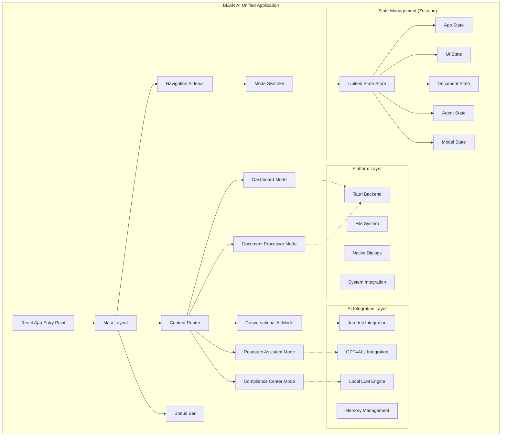
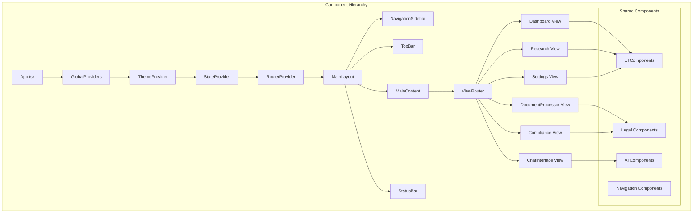
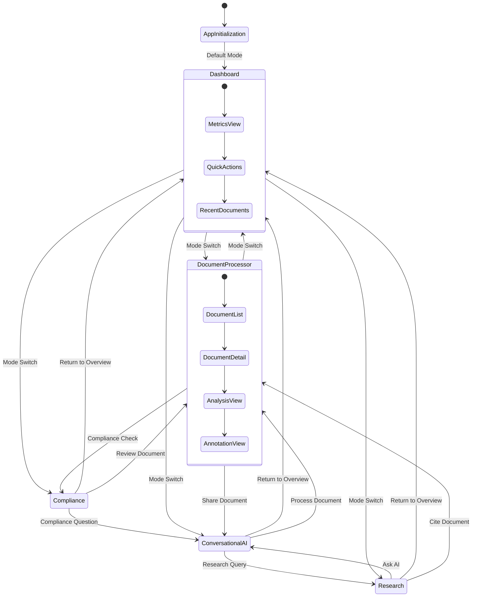
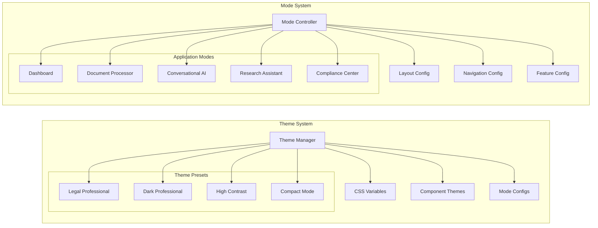
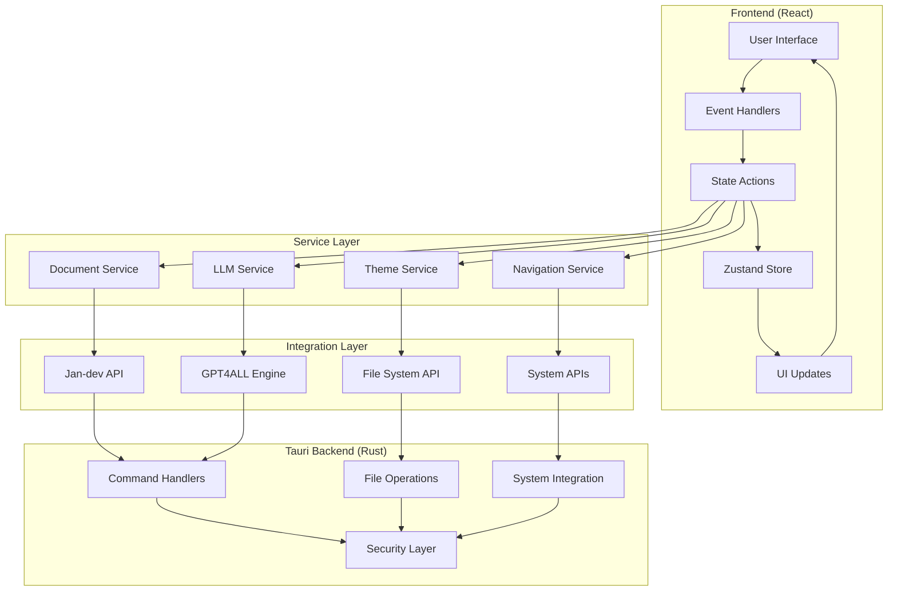
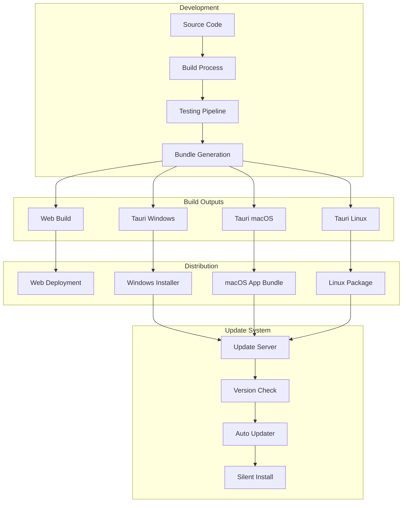
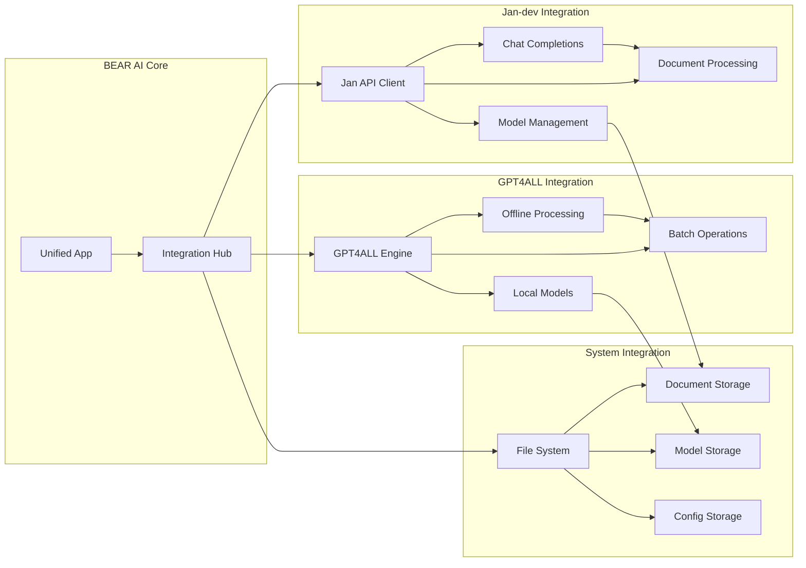
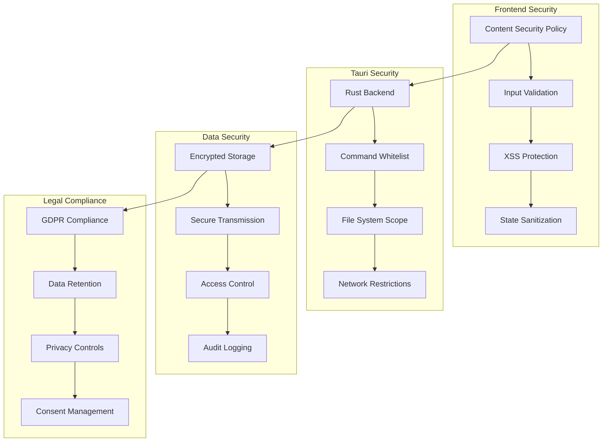
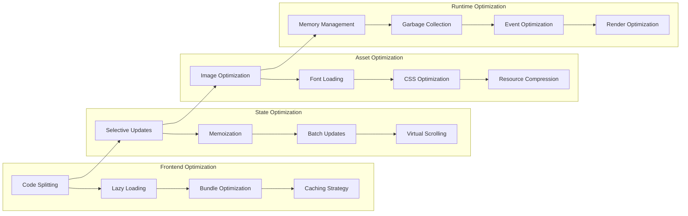
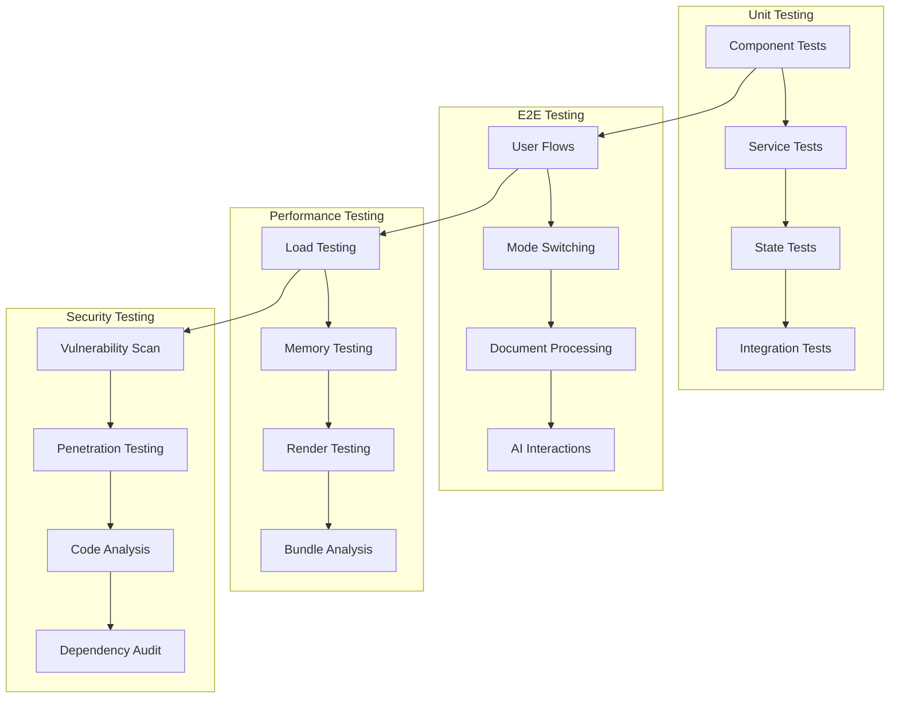

# BEAR AI Unified GUI Architecture Diagrams

## System Overview Diagram

## Component Architecture Diagram

## State Flow Diagram

## Theme and Mode System

## Data Flow Architecture

## Deployment Architecture

## Integration Patterns

## Security Architecture

## Performance Optimization

## Testing Architecture

These diagrams provide a comprehensive visual representation of the BEAR AI unified GUI architecture, showing the relationships between components, data flow, deployment strategy, and various system aspects. They serve as both design documentation and implementation guides for the development team.