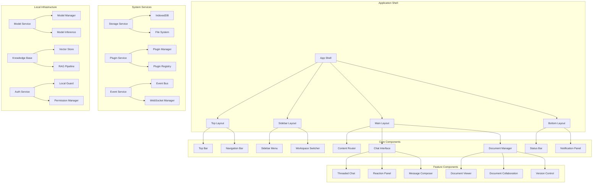
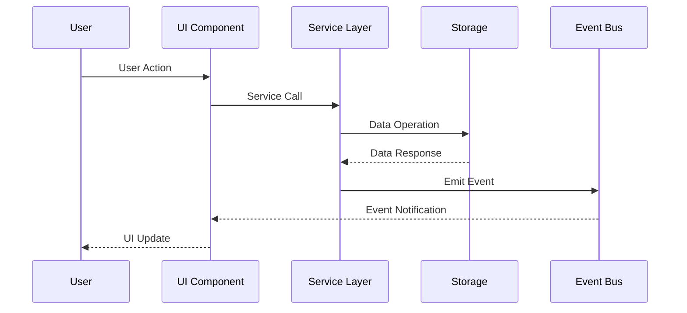
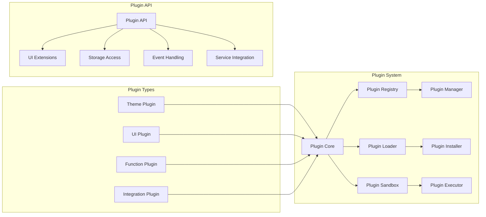
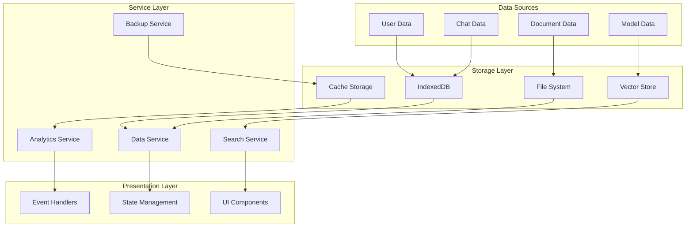
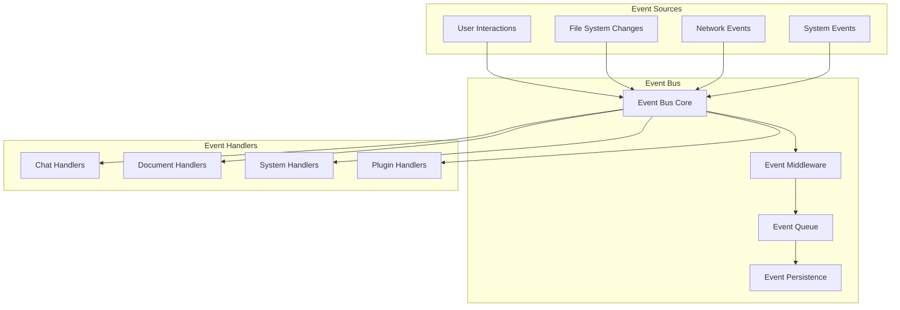

# Component Architecture Diagram
## Enhanced Modern Local Web Interface

### System Architecture Overview



### Component Interaction Flow



### Plugin Architecture



### Data Flow Architecture



### Real-time Event System



## Component Specifications

### 1. Enhanced Chat Interface Components

#### ThreadedChatInterface
```typescript
interface ThreadedChatInterface {
  props: {
    sessionId: string;
    allowThreading: boolean;
    maxDepth: number;
    realtimeUpdates: boolean;
  };
  state: {
    threads: ChatThread[];
    activeThread: string | null;
    expandedThreads: Set<string>;
    reactionPanel: ReactionPanelState;
  };
  methods: {
    createThread(parentMessageId: string): Promise<ChatThread>;
    joinThread(threadId: string): void;
    leaveThread(threadId: string): void;
    toggleThread(threadId: string): void;
    addReaction(messageId: string, emoji: string): void;
  };
}
```

#### MessageComposer
```typescript
interface MessageComposer {
  features: {
    richTextEditor: RichTextConfig;
    voiceInput: VoiceInputConfig;
    fileAttachment: AttachmentConfig;
    templateSystem: TemplateConfig;
    autoComplete: AutoCompleteConfig;
  };
  ui: {
    toolbar: ToolbarButton[];
    shortcuts: KeyboardShortcut[];
    preview: PreviewMode;
    drafts: DraftManagement;
  };
}
```

### 2. Plugin System Components

#### PluginManager
```typescript
class PluginManager {
  private registry: Map<string, Plugin> = new Map();
  private loader: PluginLoader;
  private sandbox: PluginSandbox;
  
  async installPlugin(manifest: PluginManifest): Promise<Plugin> {
    // Validate plugin
    // Check permissions
    // Load and initialize
    // Register components and hooks
  }
  
  async uninstallPlugin(pluginId: string): Promise<void> {
    // Cleanup plugin resources
    // Remove components and hooks
    // Update registry
  }
  
  getPlugin(pluginId: string): Plugin | null {
    return this.registry.get(pluginId) || null;
  }
}
```

### 3. Workspace Management Components

#### WorkspaceManager
```typescript
interface WorkspaceManager {
  currentWorkspace: Workspace | null;
  availableWorkspaces: Workspace[];
  
  methods: {
    createWorkspace(config: WorkspaceConfig): Promise<Workspace>;
    switchWorkspace(workspaceId: string): Promise<void>;
    importWorkspace(data: WorkspaceData): Promise<Workspace>;
    exportWorkspace(workspaceId: string): Promise<WorkspaceExport>;
    deleteWorkspace(workspaceId: string): Promise<void>;
  };
}
```

#### ProjectOrganizer
```typescript
interface ProjectOrganizer {
  projects: Project[];
  templates: ProjectTemplate[];
  filters: ProjectFilter[];
  
  methods: {
    createProject(template: ProjectTemplate): Promise<Project>;
    organizeProjects(criteria: OrganizationCriteria): Project[][];
    searchProjects(query: SearchQuery): Project[];
    archiveProject(projectId: string): Promise<void>;
  };
}
```

### 4. Document Collaboration Components

#### CollaborativeEditor
```typescript
interface CollaborativeEditor {
  document: SharedDocument;
  operations: OperationBuffer;
  participants: Participant[];
  
  features: {
    realTimeEditing: boolean;
    conflictResolution: ConflictStrategy;
    versionControl: VersionControlConfig;
    commentSystem: CommentConfig;
  };
  
  methods: {
    applyOperation(op: Operation): void;
    handleRemoteOperation(op: Operation): void;
    resolveConflict(conflict: Conflict): Resolution;
    createComment(selection: Selection, text: string): Comment;
  };
}
```

### 5. Model Management Components

#### ModelMarketplace
```typescript
interface ModelMarketplace {
  models: LocalModel[];
  categories: ModelCategory[];
  filters: ModelFilter[];
  
  ui: {
    grid: ModelGrid;
    details: ModelDetails;
    installation: InstallationProgress;
    management: ModelManagement;
  };
  
  methods: {
    searchModels(query: string): Promise<ModelSearchResult[]>;
    installModel(modelId: string): Promise<InstallationStatus>;
    updateModel(modelId: string): Promise<UpdateStatus>;
    removeModel(modelId: string): Promise<void>;
  };
}
```

### 6. Knowledge Base Components

#### RAGInterface
```typescript
interface RAGInterface {
  knowledgeBase: LocalKnowledgeBase;
  vectorStore: VectorStore;
  retrieval: RetrievalEngine;
  
  methods: {
    addDocument(document: Document): Promise<void>;
    query(question: string): Promise<RAGResponse>;
    getContext(question: string): Promise<DocumentContext[]>;
    explainAnswer(responseId: string): Promise<Explanation>;
  };
}
```

## Technology Integration Points

### Storage Architecture
```typescript
interface StorageArchitecture {
  primary: {
    documents: 'filesystem' | 'indexeddb';
    chats: 'indexeddb';
    models: 'filesystem';
    vectors: 'webassembly' | 'indexeddb';
  };
  
  cache: {
    ui: 'memory';
    search: 'indexeddb';
    embeddings: 'memory';
  };
  
  backup: {
    strategy: 'incremental' | 'full';
    schedule: 'daily' | 'weekly';
    storage: 'filesystem' | 'cloud';
  };
}
```

### Performance Optimization
```typescript
interface PerformanceConfig {
  rendering: {
    virtualScrolling: boolean;
    lazyLoading: boolean;
    codesplitting: boolean;
    memorization: boolean;
  };
  
  storage: {
    compression: boolean;
    indexing: boolean;
    caching: boolean;
    prefetching: boolean;
  };
  
  networking: {
    serviceWorker: boolean;
    backgroundSync: boolean;
    offline: boolean;
  };
}
```

### Accessibility Integration
```typescript
interface AccessibilityIntegration {
  screenReader: {
    announcements: LiveRegionManager;
    landmarks: LandmarkSystem;
    descriptions: ARIADescriptionManager;
  };
  
  keyboard: {
    navigation: KeyboardNavigationManager;
    shortcuts: ShortcutManager;
    focus: FocusManager;
  };
  
  visual: {
    contrast: ContrastManager;
    scaling: ScalingManager;
    motion: MotionManager;
  };
}
```

This component architecture provides a comprehensive blueprint for building the enhanced modern local web interface while maintaining separation of concerns, scalability, and maintainability.