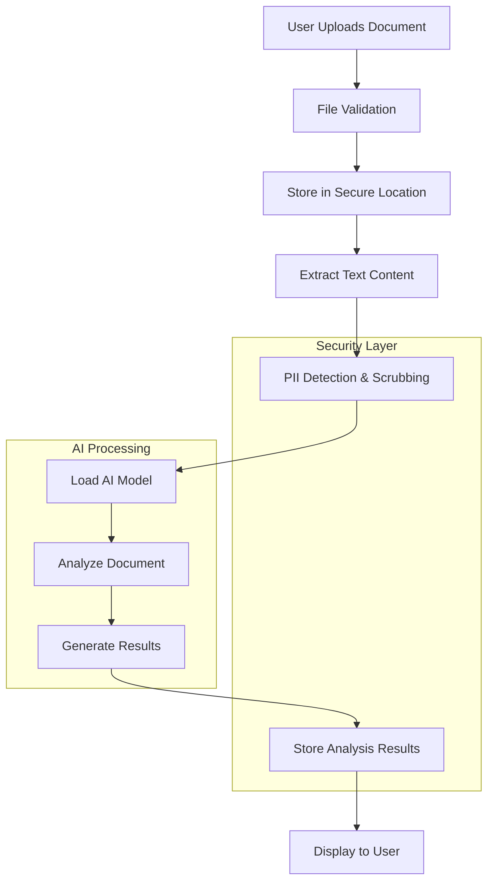
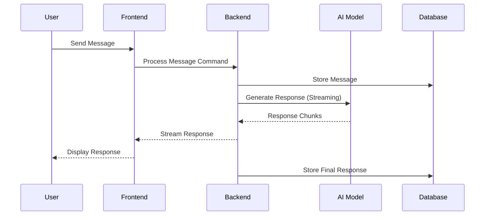
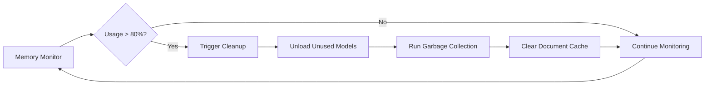
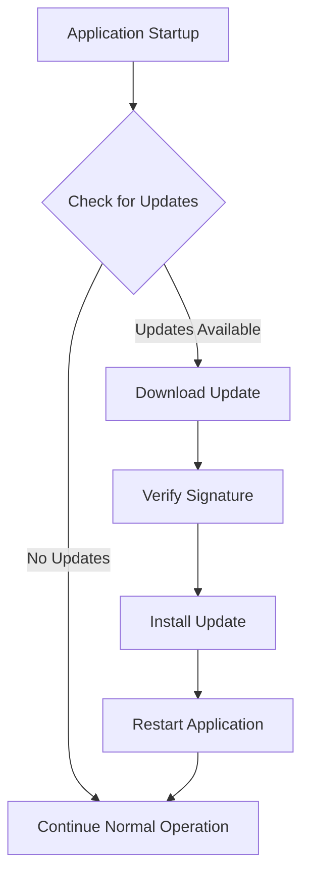

# BEAR AI Legal Architecture Overview

## Table of Contents

1. [Overview](#overview)
2. [Architecture Principles](#architecture-principles)
3. [System Components](#system-components)
4. [Technology Stack](#technology-stack)
5. [Data Flow](#data-flow)
6. [Security Architecture](#security-architecture)
7. [Performance Architecture](#performance-architecture)
8. [Deployment Architecture](#deployment-architecture)

## Overview

BEAR AI Legal Assistant employs a modern, hybrid desktop architecture that combines the best of web technologies with native performance. The system is built on a **React + TypeScript frontend** communicating with a **Tauri + Rust backend**, providing a secure, performant, and cross-platform solution for legal document analysis.

## Architecture Principles

### 1. Security First
- **Zero Trust**: No network communication required for core functionality
- **Memory Safety**: Rust backend prevents common security vulnerabilities
- **Sandboxing**: Tauri provides OS-level sandboxing
- **Data Encryption**: AES-256 encryption for sensitive data

### 2. Performance Oriented
- **Native Performance**: Rust backend for compute-intensive operations
- **Memory Efficiency**: Advanced memory management and monitoring
- **Streaming Processing**: Real-time response generation
- **GPU Acceleration**: Hardware acceleration when available

### 3. Privacy Preserving
- **Local Processing**: All AI inference happens locally
- **No Telemetry**: No data collection or transmission
- **PII Protection**: Automatic detection and scrubbing
- **Audit Trails**: Complete operation logging for compliance

### 4. Extensible Design
- **Plugin Architecture**: Extensible through plugin system
- **Modular Components**: Loosely coupled system components
- **API Layer**: Well-defined internal APIs
- **Configuration Driven**: Behavior controlled through configuration

## System Components

### Frontend Architecture (React + TypeScript)

```
src/
├── components/          # React components
│   ├── ui/             # Reusable UI components
│   ├── layout/         # Layout components
│   ├── pages/          # Page-level components
│   └── features/       # Feature-specific components
├── hooks/              # Custom React hooks
├── services/           # Business logic services
├── contexts/           # React contexts for state
├── types/              # TypeScript type definitions
├── utils/              # Utility functions
└── styles/             # CSS and styling
```

#### Component Hierarchy

```
App
├── ThemeProvider
├── AppProvider
└── Router
    ├── LoginPage (Public Route)
    └── UnifiedLayout (Protected Route)
        ├── UnifiedTopBar
        ├── UnifiedSidebar
        ├── MainContent
        │   ├── Dashboard
        │   ├── Documents
        │   ├── Chat
        │   ├── Research
        │   └── Settings
        └── UnifiedStatusBar
```

#### State Management

```typescript
// Context-based state management
interface AppState {
  user: User | null;
  sidebarCollapsed: boolean;
  currentView: string;
  systemStatus: SystemStatus;
  searchQuery: string;
  activeChat: ChatSession | null;
}

// Memory monitoring state
interface MemoryState {
  usage: number;
  status: 'normal' | 'warning' | 'critical';
  available: number;
  total: number;
  trend: 'increasing' | 'decreasing' | 'stable';
}
```

### Backend Architecture (Tauri + Rust)

```
src-tauri/
├── src/
│   ├── commands/       # Tauri commands (API endpoints)
│   │   ├── auth.rs
│   │   ├── documents.rs
│   │   ├── models.rs
│   │   ├── memory.rs
│   │   └── security.rs
│   ├── services/       # Business logic services
│   │   ├── document_service.rs
│   │   ├── model_service.rs
│   │   ├── security_service.rs
│   │   └── memory_service.rs
│   ├── utils/          # Utility functions
│   ├── models/         # Data models
│   └── main.rs         # Application entry point
├── icons/              # Application icons
└── Cargo.toml          # Rust dependencies
```

#### Core Services

```rust
// Service architecture
pub struct AppState {
    pub document_service: Arc<RwLock<DocumentService>>,
    pub model_service: Arc<RwLock<ModelService>>,
    pub security_service: Arc<RwLock<SecurityService>>,
    pub memory_monitor: Arc<RwLock<MemoryMonitor>>,
}

// Service traits for dependency injection
trait DocumentProcessor {
    async fn analyze(&self, doc_id: &str, options: &AnalysisOptions) -> Result<Analysis>;
    async fn extract_text(&self, doc_id: &str) -> Result<String>;
    async fn detect_pii(&self, text: &str) -> Result<Vec<PIIMatch>>;
}
```

## Technology Stack

### Frontend Technologies

| Category | Technology | Purpose |
|----------|------------|---------|
| **Framework** | React 18 | Component-based UI framework |
| **Language** | TypeScript | Type-safe JavaScript development |
| **Styling** | TailwindCSS | Utility-first CSS framework |
| **Icons** | Lucide React | Consistent icon library |
| **Routing** | React Router | Client-side routing |
| **State** | React Context | Global state management |
| **Build** | Vite | Fast build tool and dev server |

### Backend Technologies

| Category | Technology | Purpose |
|----------|------------|---------|
| **Framework** | Tauri | Desktop app framework |
| **Language** | Rust | Systems programming language |
| **AI/ML** | llama.cpp | Local LLM inference |
| **Database** | SQLite | Embedded database |
| **Crypto** | RustCrypto | Cryptographic operations |
| **Serialization** | Serde | Data serialization |
| **Async** | Tokio | Asynchronous runtime |

### System Dependencies

| Component | Purpose | Platforms |
|-----------|---------|-----------|
| **WebView** | UI rendering | All platforms |
| **CUDA** | GPU acceleration | Windows, Linux |
| **Metal** | GPU acceleration | macOS |
| **OpenSSL** | Cryptographic operations | All platforms |
| **SQLite** | Local data storage | All platforms |

## Data Flow

### Document Processing Flow



### Chat Interaction Flow



### Memory Management Flow



## Security Architecture

### Security Layers

#### 1. Operating System Level
```
┌─────────────────────────────────────────┐
│            Operating System             │
├─────────────────────────────────────────┤
│     Tauri Security Sandbox             │
├─────────────────────────────────────────┤
│        Rust Memory Safety              │
├─────────────────────────────────────────┤
│      Application Security Layer        │
└─────────────────────────────────────────┘
```

#### 2. Application Security Controls

```rust
// Security configuration
pub struct SecurityConfig {
    pub pii_detection: PIIConfig,
    pub encryption: EncryptionConfig,
    pub audit_logging: AuditConfig,
    pub access_control: AccessConfig,
}

// PII protection
pub struct PIIDetector {
    patterns: Vec<PIIPattern>,
    confidence_threshold: f64,
    scrubbing_mode: ScrubMode,
}
```

#### 3. Data Protection

```
Data at Rest:
├── AES-256-GCM encryption
├── Secure key derivation (PBKDF2)
├── Per-document encryption keys
└── Secure deletion on removal

Data in Processing:
├── Memory encryption zones
├── Secure memory allocation
├── Automatic memory clearing
└── Stack protection
```

### Threat Model

#### Threats Mitigated

1. **Data Exfiltration**
   - No network communications
   - Local-only processing
   - Encrypted storage

2. **Memory Attacks**
   - Rust memory safety
   - Secure memory allocation
   - Automatic cleanup

3. **Privilege Escalation**
   - Tauri sandboxing
   - Minimal permissions
   - OS-level security

4. **Supply Chain Attacks**
   - Dependency auditing
   - Reproducible builds
   - Code signing

## Performance Architecture

### Performance Optimization Strategies

#### 1. Memory Management

```rust
// Memory-aware processing
pub struct MemoryAwareProcessor {
    memory_threshold: f64,
    chunk_size: usize,
    concurrent_limit: usize,
}

impl MemoryAwareProcessor {
    pub async fn process_document(&self, doc: &Document) -> Result<Analysis> {
        let memory_usage = self.get_memory_usage().await?;
        
        if memory_usage > self.memory_threshold {
            self.process_in_chunks(doc).await
        } else {
            self.process_full(doc).await
        }
    }
}
```

#### 2. Streaming Processing

```typescript
// Frontend streaming interface
const useStreamingAnalysis = () => {
  const [chunks, setChunks] = useState<AnalysisChunk[]>([]);
  const [isComplete, setIsComplete] = useState(false);
  
  const processDocument = async (documentId: string) => {
    const stream = await invoke('analyze_document_stream', { documentId });
    
    for await (const chunk of stream) {
      setChunks(prev => [...prev, chunk]);
      
      if (chunk.isComplete) {
        setIsComplete(true);
        break;
      }
    }
  };
  
  return { chunks, isComplete, processDocument };
};
```

#### 3. Resource Optimization

```
Resource Management:
├── Model Caching Strategy
│   ├── LRU cache for frequently used models
│   ├── Automatic unloading of unused models
│   └── Progressive model loading
├── Document Processing
│   ├── Lazy loading of document content
│   ├── Chunked processing for large files
│   └── Background processing queue
└── Memory Optimization
    ├── Real-time memory monitoring
    ├── Automatic garbage collection
    └── Memory pressure handling
```

### Performance Metrics

```typescript
interface PerformanceMetrics {
  modelLoadTime: number;          // Time to load AI model (ms)
  documentProcessingRate: number; // Pages per second
  memoryUsage: MemoryMetrics;     // Current memory usage
  gpuUtilization: number;         // GPU usage percentage
  responseLatency: number;        // Chat response time (ms)
}
```

## Deployment Architecture

### Desktop Application Packaging

```
Desktop Application:
├── React Bundle (Frontend)
│   ├── JavaScript/TypeScript compiled
│   ├── CSS optimized and minified
│   └── Assets bundled and compressed
├── Tauri Runtime (Backend)
│   ├── Rust binary compiled for target
│   ├── WebView integration
│   └── OS-specific APIs
├── AI Models (Optional)
│   ├── Bundled models for offline use
│   ├── Model download capability
│   └── Model management system
└── Installation Package
    ├── Windows: MSI/NSIS installer
    ├── macOS: DMG with app bundle
    └── Linux: AppImage/DEB/RPM
```

### Update Architecture



### Configuration Management

```
Configuration Hierarchy:
├── Default Configuration (Built-in)
├── System Configuration (/etc/bear-ai/)
├── User Configuration (~/.config/bear-ai/)
└── Runtime Configuration (Memory)

Configuration Sources:
├── JSON configuration files
├── Environment variables
├── Command-line arguments
└── Runtime API calls
```

## Integration Points

### External Integrations

```typescript
// Plugin architecture for extensions
interface PluginAPI {
  // Document processing hooks
  beforeDocumentAnalysis?(doc: Document): Promise<Document>;
  afterDocumentAnalysis?(result: AnalysisResult): Promise<AnalysisResult>;
  
  // UI customization hooks
  renderCustomComponent?(props: ComponentProps): React.ReactNode;
  addMenuItem?(menu: MenuItem[]): MenuItem[];
  
  // Data processing hooks
  processText?(text: string): Promise<string>;
  extractMetadata?(doc: Document): Promise<Metadata>;
}

// Example legal citation plugin
export const CitationPlugin: Plugin = {
  name: 'legal-citations',
  version: '1.0.0',
  
  hooks: {
    afterDocumentAnalysis: async (result) => {
      const citations = await extractLegalCitations(result.text);
      return {
        ...result,
        citations: formatCitations(citations)
      };
    }
  }
};
```

### API Design

```rust
// Internal API structure
#[tauri::command]
pub async fn analyze_document(
    app_handle: AppHandle,
    document_id: String,
    options: AnalysisOptions,
) -> Result<DocumentAnalysis, String> {
    let state = app_handle.state::<AppState>();
    
    // Memory check before processing
    let memory_usage = state.memory_monitor.read().await.get_usage();
    if memory_usage > 0.9 {
        return Err("Insufficient memory for analysis".to_string());
    }
    
    // Process document with security checks
    state
        .document_service
        .read()
        .await
        .analyze_secure(&document_id, &options)
        .await
        .map_err(|e| e.to_string())
}
```

## Monitoring and Observability

### Performance Monitoring

```typescript
// Built-in performance monitoring
interface SystemMetrics {
  cpu: CPUMetrics;
  memory: MemoryMetrics;
  storage: StorageMetrics;
  gpu: GPUMetrics;
  network: NetworkMetrics;
}

// Real-time monitoring service
class PerformanceMonitor {
  private metrics: SystemMetrics;
  
  public startMonitoring(): void {
    setInterval(() => {
      this.collectMetrics();
      this.checkThresholds();
      this.updateUI();
    }, 1000);
  }
}
```

### Error Handling and Recovery

```rust
// Comprehensive error handling
#[derive(Debug, thiserror::Error)]
pub enum BearAIError {
    #[error("Document processing failed: {0}")]
    DocumentProcessing(String),
    
    #[error("Model loading failed: {0}")]
    ModelLoading(String),
    
    #[error("Memory limit exceeded")]
    OutOfMemory,
    
    #[error("Security violation: {0}")]
    SecurityViolation(String),
}

// Recovery mechanisms
impl ErrorRecovery for BearAIError {
    async fn recover(&self) -> Result<(), Self> {
        match self {
            BearAIError::OutOfMemory => {
                // Clear caches and try again
                clear_model_cache().await?;
                run_garbage_collection().await?;
                Ok(())
            },
            BearAIError::ModelLoading(_) => {
                // Try alternative model
                load_fallback_model().await?;
                Ok(())
            },
            _ => Err(self.clone())
        }
    }
}
```

This architecture provides a robust, secure, and performant foundation for BEAR AI Legal Assistant while maintaining flexibility for future enhancements and integrations.