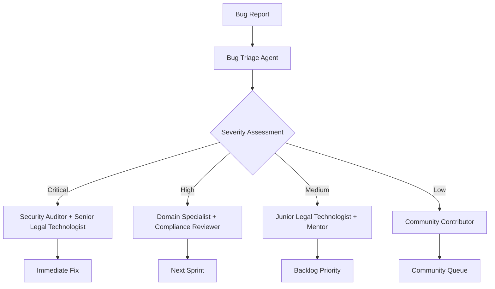

# BEAR AI Swarm Task Distribution Guide
*Agent Coordination and Task Distribution Strategy*

## Overview

This guide outlines the recommended swarm task distribution strategy for BEAR AI development, leveraging Claude-Flow's agent coordination capabilities to optimize development velocity and code quality.

## 1. Agent Specialization Matrix

### 1.1 Core Development Agents

| Agent Type | Primary Focus | Key Skills | Recommended Tasks |
|------------|---------------|------------|-------------------|
| **Legal Workflow Designer** | React/TypeScript UI | Component development, state management | UI components, theme system, responsive design |
| **Litigation Data Specialist** | Python/Express APIs | Server-side logic, database design | API endpoints, authentication, data processing |
| **Tauri Specialist** | Desktop integration | Rust, native APIs, system integration | Desktop features, file system, system tray |
| **Legal Intelligence Specialist** | Model integration | llama.cpp, GPU optimization, inference | Model management, performance optimization |
| **Security Auditor** | Privacy & security | Encryption, PII detection, audit trails | Security features, compliance, vulnerability assessment |
| **Legal Efficiency Analyst** | System efficiency | Profiling, caching, resource management | Performance monitoring, optimization, scalability |

### 1.2 Specialized Support Agents

| Agent Type | Domain | Responsibilities |
|------------|--------|------------------|
| **Testing Coordinator** | Quality assurance | Unit tests, integration tests, E2E testing |
| **Legal Documentation Writer** | Technical communication | API docs, user guides, architectural documentation |
| **Accessibility Specialist** | WCAG compliance | Screen reader support, keyboard navigation, ARIA |
| **Build Engineer** | DevOps | CI/CD pipelines, deployment automation, build optimization |
| **Legal Experience Designer** | User experience | Interface design, user flows, usability testing |
| **Compliance Reviewer** | Quality control | Code review, best practices, technical debt management |

## 2. Task Distribution Strategy

### 2.1 Parallel Development Streams

#### Stream 1: Frontend Enhancement (4-6 agents)
```typescript
// Primary agents working in parallel
const frontendTeam = [
  {
    agent: "Legal Interface Specialist",
    tasks: [
      "Implement advanced chat interface components",
      "Develop unified layout system",
      "Create responsive grid components"
    ]
  },
  {
    agent: "Theme Architect", 
    tasks: [
      "Enhance CSS custom properties system",
      "Implement dynamic theme switching",
      "Develop color palette management"
    ]
  },
  {
    agent: "State Manager",
    tasks: [
      "Optimize context providers",
      "Implement persistent state management", 
      "Develop real-time state synchronization"
    ]
  },
  {
    agent: "Accessibility Specialist",
    tasks: [
      "ARIA label implementation",
      "Keyboard navigation optimization",
      "Screen reader compatibility testing"
    ]
  }
]
```

#### Stream 2: Backend Optimization (3-4 agents)
```python
# Backend development coordination
backend_assignments = {
    "Python Legal Intelligence Specialist": [
        "Optimize llama.cpp inference pipeline",
        "Implement GPU acceleration fallback",
        "Develop model hot-swapping system"
    ],
    "Legal API Liaison": [
        "Enhance Express.js middleware",
        "Implement rate limiting and caching",
        "Develop WebSocket for real-time updates"
    ],
    "Security Auditor": [
        "PII detection algorithm enhancement", 
        "Audit logging system implementation",
        "Encryption key management system"
    ],
    "Legal Efficiency Analyst": [
        "Memory usage optimization",
        "Response time monitoring",
        "Resource allocation algorithms"
    ]
}
```

#### Stream 3: Desktop Integration (2-3 agents)
```rust
// Tauri-focused development stream
struct TauriTeam {
    tauri_specialist: Vec<&str> = vec![
        "System tray menu enhancement",
        "File system permission management", 
        "Native notification system"
    ],
    deployment_specialist: Vec<&str> = vec![
        "Cross-platform build optimization",
        "Installer script development",
        "Update mechanism implementation"
    ],
    platform_quality_analyst: Vec<&str> = vec![
        "Windows compatibility testing",
        "macOS integration validation",
        "Linux distribution testing"
    ]
}
```

### 2.2 Task Prioritization Matrix

#### High Priority (Immediate - 1-2 weeks)
1. **GUI Consolidation Completion**
   - Agent: Legal Workflow Designer + Theme Architect
   - Tasks: Complete unified interface, fix theme switching bugs
   - Blockers: None
   - Dependencies: Theme system architecture

2. **Memory Management Enhancement**
   - Agent: Legal Efficiency Analyst + Legal Intelligence Specialist
   - Tasks: Real-time monitoring, optimization algorithms
   - Blockers: None
   - Dependencies: System metrics API

3. **Security Audit Implementation**
   - Agent: Security Auditor + Compliance Reviewer
   - Tasks: PII detection, audit trails, vulnerability assessment
   - Blockers: None
   - Dependencies: Authentication system

#### Medium Priority (2-4 weeks)
1. **GPU Acceleration Optimization**
   - Agent: Legal Intelligence Specialist + Legal Efficiency Analyst
   - Tasks: CUDA integration, fallback mechanisms, benchmarking
   - Blockers: Hardware availability for testing
   - Dependencies: Inference engine

2. **Testing Framework Expansion**
   - Agent: Testing Coordinator + Legal Workflow Designer
   - Tasks: Unit tests, integration tests, E2E automation
   - Blockers: None
   - Dependencies: Component architecture

3. **Documentation System**
   - Agent: Legal Documentation Writer + Legal API Liaison
   - Tasks: API documentation, user guides, developer docs
   - Blockers: None
   - Dependencies: API stability

#### Lower Priority (4-8 weeks)
1. **Plugin Architecture**
   - Agent: Litigation Data Specialist + Legal Workflow Designer
   - Tasks: Plugin system design, SDK development, marketplace
   - Blockers: Architecture decisions needed
   - Dependencies: Core system stability

2. **Advanced Analytics**
   - Agent: Legal Efficiency Analyst + Legal Intelligence Specialist
   - Tasks: Usage analytics, performance metrics, predictive optimization
   - Blockers: Privacy compliance review
   - Dependencies: Data collection framework

## 3. Coordination Patterns

### 3.1 Agent Communication Protocol

```yaml
# Claude-Flow coordination setup
coordination_topology:
  type: "hierarchical"
  lead_coordinators:
    - "legal-architecture-lead"
    - "tech-lead" 
  
  development_clusters:
    frontend_cluster:
      coordinator: "senior-intake-specialist"
      agents: ["legal-interface-specialist", "legal-theme-architect", "legal-experience-designer"]
      
    backend_cluster:
      coordinator: "senior-litigation-data-specialist" 
      agents: ["legal-automation-specialist", "legal-api-liaison", "security-auditor"]
      
    platform_cluster:
      coordinator: "platform-lead"
      agents: ["tauri-specialist", "deployment-specialist", "legal-efficiency-analyst"]
```

### 3.2 Synchronization Points

**Daily Standups (Automated)**
- Progress updates from each agent
- Blocker identification and resolution
- Task redistribution if needed
- Cross-stream dependency coordination

**Weekly Architecture Reviews**
- Component interface stability
- Performance metric analysis
- Security audit results
- Technical debt assessment

**Sprint Planning (Bi-weekly)**
- Feature prioritization based on user feedback
- Resource allocation optimization
- Risk assessment and mitigation
- Delivery timeline adjustment

### 3.3 Quality Gates

```typescript
interface QualityGate {
  name: string
  trigger: 'pull_request' | 'merge' | 'deploy'
  agents_required: string[]
  criteria: QualityCriteria
}

const QUALITY_GATES: QualityGate[] = [
  {
    name: "Code Review Gate",
    trigger: "pull_request",
    agents_required: ["code-compliance-reviewer", "security-auditor"],
    criteria: {
      test_coverage: ">= 80%",
      security_scan: "no_high_vulnerabilities", 
      performance_impact: "<= 5%_regression"
    }
  },
  {
    name: "Integration Gate", 
    trigger: "merge",
    agents_required: ["testing-coordinator", "legal-efficiency-analyst"],
    criteria: {
      integration_tests: "all_passing",
      performance_benchmarks: "within_acceptable_range",
      accessibility_score: ">= 95"
    }
  }
]
```

## 4. Development Workflow

### 4.1 Feature Development Cycle

1. **Requirements Analysis**
   - Agent: Legal Architecture Lead + Domain Expert
   - Output: Technical specifications, acceptance criteria

2. **Design Phase**
   - Agent: Legal Experience Designer + Legal Workflow Designer
   - Output: UI mockups, component specifications

3. **Implementation Phase**
   - Agents: Specialized developers based on feature area
   - Output: Functional code with tests

4. **Integration Phase**
   - Agent: Testing Coordinator + Legal Efficiency Analyst
   - Output: Integrated feature with performance validation

5. **Review & Polish**
   - Agent: Compliance Reviewer + Security Auditor
   - Output: Production-ready feature

### 4.2 Bug Triage and Resolution



### 4.3 Performance Optimization Workflow

1. **Monitoring Agent**: Continuous performance monitoring
2. **Analysis Agent**: Performance bottleneck identification
3. **Optimization Agent**: Implementation of performance improvements
4. **Validation Agent**: Verification of optimization effectiveness

## 5. Resource Allocation Strategy

### 5.1 Agent Capacity Planning

| Development Phase | Agent Allocation | Focus Areas |
|-------------------|------------------|-------------|
| **Foundation** (Weeks 1-2) | 8-10 agents | Architecture, build system, core components |
| **Feature Development** (Weeks 3-8) | 12-15 agents | Parallel feature streams, testing, documentation |
| **Integration** (Weeks 9-10) | 6-8 agents | System integration, performance tuning, bug fixes |
| **Polish** (Weeks 11-12) | 4-6 agents | UI polish, documentation, final testing |

### 5.2 Scaling Strategy

**Scale Up Triggers:**
- Complex feature requirements
- Performance bottlenecks
- Security vulnerabilities
- Testing coverage gaps

**Scale Down Triggers:**
- Feature completion
- Technical debt resolution
- Stable performance metrics
- Comprehensive test coverage

## 6. Success Metrics

### 6.1 Development Velocity Metrics
- **Feature Delivery Rate**: Features completed per sprint
- **Bug Resolution Time**: Average time from report to resolution  
- **Code Quality Score**: Based on review feedback and static analysis
- **Test Coverage**: Percentage of code covered by automated tests

### 6.2 Agent Performance Metrics
- **Task Completion Rate**: Percentage of assigned tasks completed on time
- **Code Review Quality**: Defect detection rate in reviews
- **Knowledge Sharing**: Contribution to documentation and mentoring
- **Innovation Index**: New ideas and improvement suggestions implemented

### 6.3 System Quality Metrics
- **Performance Benchmarks**: Response times, memory usage, CPU utilization
- **Security Score**: Vulnerability count, compliance percentage
- **Accessibility Rating**: WCAG compliance score
- **User Satisfaction**: Based on feedback and usage analytics

## 7. Risk Mitigation

### 7.1 Common Risks and Mitigation Strategies

| Risk | Probability | Impact | Mitigation Strategy | Responsible Agent |
|------|-------------|---------|-------------------|-------------------|
| **Integration Complexity** | High | High | Incremental integration, extensive testing | Legal Architecture Lead |
| **Performance Degradation** | Medium | High | Continuous monitoring, optimization cycles | Legal Efficiency Analyst |
| **Security Vulnerabilities** | Medium | Critical | Regular audits, secure coding practices | Security Auditor |
| **Technical Debt Accumulation** | High | Medium | Regular refactoring, code quality gates | Compliance Reviewer |
| **Agent Coordination Overhead** | Medium | Medium | Automated coordination tools, clear protocols | Tech Lead |

### 7.2 Contingency Planning

**Agent Unavailability:**
- Cross-training across agent types
- Knowledge documentation requirements
- Backup agent assignment protocols

**Technical Blockers:**
- Alternative solution research agents
- Rapid prototyping capabilities
- External expert consultation process

**Scope Creep:**
- Requirements validation agents
- Change impact assessment protocols
- Stakeholder communication agents

---

**Guide Prepared By:** Legal Architecture Overview Designer  
**Last Updated:** January 11, 2025  
**Version:** 1.0  
**Target Audience:** Development teams, project managers, technical leads