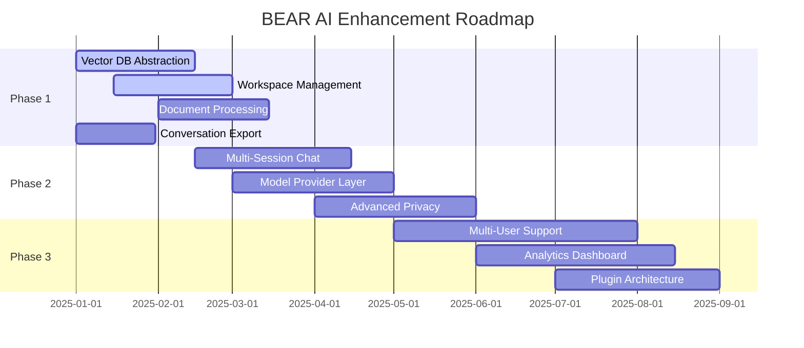

# BEAR AI Enhancement Roadmap - AnythingLLM Integration

## Overview
This roadmap outlines the integration of AnythingLLM's proven features into BEAR AI, organized by priority and implementation complexity. Each phase builds upon previous work while delivering immediate value to users.

## Priority Matrix Analysis

### Impact vs Effort Assessment

| Feature | Impact | Effort | Priority | Timeline |
|---------|---------|---------|----------|----------|
| Vector Database Abstraction | High | Medium | P0 | 0-2 months |
| Workspace Management | High | Medium | P0 | 0-2 months |
| Document Processing Enhancement | High | Medium | P0 | 1-3 months |
| Conversation Export | Medium | Low | P1 | 0-1 months |
| Multi-Session Chat Management | High | High | P1 | 2-4 months |
| Model Provider Abstraction | High | High | P1 | 2-4 months |
| Advanced Privacy Controls | Medium | Medium | P2 | 3-5 months |
| Collaborative Features | High | High | P2 | 4-8 months |
| Real-time Analytics | Medium | Medium | P3 | 6-8 months |
| Mobile Companion | Low | High | P3 | 8+ months |

## Phase 1: Foundation Enhancement (Months 0-3)

### P0 Features - Critical Path

#### 1.1 Vector Database Abstraction Layer
**Goal**: Enhanced offline vector storage with LanceDB as primary provider

**Implementation Plan**:
```typescript
// Week 1-2: Interface Design
interface VectorStoreProvider {
  name: string;
  connect(config: VectorStoreConfig): Promise<VectorStore>;
  query(embedding: number[], k: number): Promise<Document[]>;
  store(documents: ProcessedDocument[]): Promise<void>;
  delete(ids: string[]): Promise<void>;
}

// Week 3-4: Core Providers
- LanceDB (primary offline provider)
- Local SQLite vector extensions
- In-memory vector store for testing

// Week 5-6: Configuration System
- Provider switching UI
- Migration utilities
- Performance benchmarking
```

**Success Metrics**:
- Support for 3+ vector databases
- < 10% performance degradation
- Seamless provider switching

#### 1.2 Workspace Management System
**Goal**: Organize documents and conversations into isolated contexts

**Implementation Plan**:
```typescript
// Week 1-2: Data Models
interface Workspace {
  id: string;
  name: string;
  type: 'legal-research' | 'case-analysis' | 'contract-review' | 'general';
  settings: WorkspaceSettings;
  createdAt: Date;
}

// Week 3-4: Core Features
- Workspace creation/deletion
- Document organization
- Basic settings management

// Week 5-6: UI Implementation
- Workspace switcher component
- Document assignment interface
- Settings panel
```

**Success Metrics**:
- Users creating average 3+ workspaces
- 90% document organization rate
- Workspace switching < 2 seconds

#### 1.3 Enhanced Document Processing
**Goal**: Implement layout-aware chunking and multi-format support

**Implementation Plan**:
```typescript
// Week 1-3: Processing Engine
class AdvancedDocumentProcessor {
  async processWithLayout(file: File): Promise<ProcessedDocument> {
    // Layout detection
    // Semantic chunking
    // Metadata extraction
  }
}

// Week 4-6: Format Support
- Audio transcription (whisper-small)
- Advanced PDF parsing
- DOCX structure preservation
- Batch processing queue
```

**Success Metrics**:
- Support for 8+ file formats
- 50% improvement in chunk quality
- Batch processing capability

### P1 Features - High Value

#### 1.4 Conversation Export System
**Goal**: Enable data portability and training data creation

**Implementation Plan**:
```typescript
// Week 1: Export Formats
- CSV export
- JSON export  
- JSONL (OpenAI fine-tune format)

// Week 2: UI Integration
- Export dialog component
- Format selection
- Progress tracking
```

**Success Metrics**:
- Export completion rate > 95%
- Support for 3 export formats
- Export time < 30 seconds for 1000 messages

## Phase 2: Advanced Features (Months 2-6)

### P1 Features - Core Enhancements

#### 2.1 Multi-Session Conversation Management
**Goal**: Enable conversation threading and branching

**Technical Architecture**:
```typescript
interface ConversationThread {
  id: string;
  workspaceId: string;
  title: string;
  messages: Message[];
  branches: ConversationBranch[];
  metadata: {
    model: string;
    settings: ChatSettings;
    tags: string[];
  };
}
```

**Implementation Timeline**:
- **Month 2**: Database schema and core models
- **Month 3**: Threading UI components
- **Month 4**: Branch management and conversation forking

#### 2.2 Model Provider Abstraction
**Goal**: Support multiple LLM providers with hot-swapping

**Provider Integration Plan**:
```typescript
// Supported providers
- OpenAI / Azure OpenAI
- Ollama (local models)
- Hugging Face
- Anthropic Claude
- Google Vertex AI
- Custom GGUF models
```

**Implementation Timeline**:
- **Month 2-3**: Provider interface design and OpenAI/Ollama integration
- **Month 4**: Additional cloud providers
- **Month 5**: Custom model support and optimization

#### 2.3 Advanced Privacy Controls
**Goal**: Granular privacy settings and audit capabilities

**Features**:
- Per-workspace privacy levels
- Comprehensive audit logging
- Data residency controls
- Enhanced PII detection

## Phase 3: Collaboration & Analytics (Months 4-8)

### P2 Features - Professional Enhancement

#### 3.1 Multi-User Support
**Goal**: Enable team collaboration with role-based access

**Components**:
- User authentication and authorization
- Workspace sharing and permissions
- Real-time collaboration indicators
- Comment and annotation system

#### 3.2 Advanced Analytics Dashboard
**Goal**: Provide insights into usage and performance

**Metrics Tracked**:
- Workspace activity and usage patterns
- Model performance and costs
- Document processing statistics
- User engagement metrics

#### 3.3 Plugin Architecture Enhancement
**Goal**: Enable third-party integrations and customizations

**Integration Points**:
- Document processors
- LLM providers  
- Vector databases
- Export formats
- UI components

## Phase 4: Ecosystem & Scale (Months 6-12)

### P3 Features - Future Vision

#### 4.1 AI Agent System
**Goal**: Automated workflows and document processing

#### 4.2 Cloud Hybrid Mode
**Goal**: Optional cloud synchronization and backup

#### 4.3 Mobile Companion App
**Goal**: Basic mobile interface for document access

## Technical Specifications

### Database Migrations
```sql
-- Phase 1 migrations
CREATE TABLE workspaces (
  id UUID PRIMARY KEY DEFAULT gen_random_uuid(),
  name VARCHAR(255) NOT NULL,
  type VARCHAR(50) DEFAULT 'general',
  settings JSONB DEFAULT '{}',
  created_at TIMESTAMP DEFAULT NOW(),
  updated_at TIMESTAMP DEFAULT NOW()
);

CREATE TABLE conversation_threads (
  id UUID PRIMARY KEY DEFAULT gen_random_uuid(),
  workspace_id UUID REFERENCES workspaces(id) ON DELETE CASCADE,
  title VARCHAR(255),
  metadata JSONB DEFAULT '{}',
  created_at TIMESTAMP DEFAULT NOW()
);

CREATE TABLE vector_store_configs (
  id UUID PRIMARY KEY DEFAULT gen_random_uuid(),
  workspace_id UUID REFERENCES workspaces(id) ON DELETE CASCADE,
  provider VARCHAR(50) NOT NULL,
  config JSONB NOT NULL,
  is_active BOOLEAN DEFAULT false
);
```

### Configuration Updates
```yaml
# bear_ai_config.yaml additions
features:
  workspaces:
    enabled: true
    max_per_user: 50
    auto_cleanup_days: 90
  
  vector_stores:
    default_provider: "lancedb"
    providers:
      lancedb:
        enabled: true
        path: "./data/vector_stores"
      chroma:
        enabled: true  
        path: "./data/chroma_db"
      pgvector:
        enabled: false
        connection_string: ""
  
  document_processing:
    chunking_strategy: "layout-aware"
    max_chunk_size: 1000
    overlap_size: 200
    batch_size: 10
    
  conversations:
    max_threads_per_workspace: 100
    auto_title_generation: true
    export_formats: ["csv", "json", "jsonl"]
```

### API Extensions
```typescript
// New API endpoints
/api/v1/workspaces
  GET    /           - List workspaces
  POST   /           - Create workspace
  GET    /:id        - Get workspace details
  PUT    /:id        - Update workspace
  DELETE /:id        - Delete workspace

/api/v1/workspaces/:id/conversations
  GET    /           - List conversation threads
  POST   /           - Create new thread
  GET    /:threadId  - Get thread messages
  PUT    /:threadId  - Update thread
  
/api/v1/workspaces/:id/documents
  GET    /           - List workspace documents
  POST   /           - Upload document to workspace
  DELETE /:docId     - Remove document from workspace

/api/v1/export
  POST   /conversations - Export conversations in specified format
  GET    /:exportId     - Download export file
```

## Resource Requirements

### Development Resources
- **Phase 1**: 2-3 developers, 3 months
- **Phase 2**: 3-4 developers, 4 months  
- **Phase 3**: 4-5 developers, 4 months
- **Phase 4**: 5-6 developers, 6 months

### Infrastructure Considerations
- **Storage**: Additional 20-30% for workspace isolation
- **Memory**: 15-25% increase for multiple vector stores
- **CPU**: Minimal impact with proper caching
- **Network**: Cloud provider integration bandwidth

## Risk Mitigation

### Technical Risks
1. **Database Migration Complexity**
   - Mitigation: Phased migration with rollback capability
   - Testing: Comprehensive migration testing on production data copies

2. **Performance Degradation**
   - Mitigation: Performance benchmarking at each phase
   - Monitoring: Real-time performance metrics dashboard

3. **Feature Complexity Creep**
   - Mitigation: Strict scope definition and feature flags
   - Review: Weekly architecture review meetings

### User Experience Risks
1. **Learning Curve for New Features**
   - Mitigation: Progressive disclosure and guided onboarding
   - Documentation: Interactive tutorials and help system

2. **Data Migration Issues**
   - Mitigation: Automatic workspace creation for existing data
   - Backup: Full data backup before each migration

## Success Metrics and KPIs

### Phase 1 Success Criteria
- [ ] 3+ vector database providers supported
- [ ] Workspace creation rate > 80% of active users
- [ ] Document processing success rate > 95%
- [ ] Performance degradation < 10%

### Phase 2 Success Criteria
- [ ] Average 5+ conversation threads per workspace
- [ ] Model switching adoption > 60%
- [ ] Export feature usage > 40% monthly active users
- [ ] User satisfaction score improvement > 20%

### Phase 3 Success Criteria
- [ ] Multi-user workspace sharing > 30% of workspaces
- [ ] Analytics dashboard daily active usage > 50%
- [ ] Plugin installation rate > 25% of users
- [ ] Enterprise customer acquisition > 10 customers

## Communication Plan

### Stakeholder Updates
- **Weekly**: Development team standups
- **Bi-weekly**: Product owner reviews
- **Monthly**: Stakeholder progress reports
- **Quarterly**: Strategic roadmap reviews

### User Communication
- **Feature Previews**: Beta testing programs for early adopters
- **Release Notes**: Detailed feature documentation and migration guides
- **Training Materials**: Video tutorials and documentation updates
- **Community Engagement**: Regular feedback collection and feature requests

## Implementation Timeline Summary



This comprehensive roadmap provides a structured approach to integrating AnythingLLM's best features into BEAR AI while maintaining focus on legal professionals' needs and privacy-first principles.